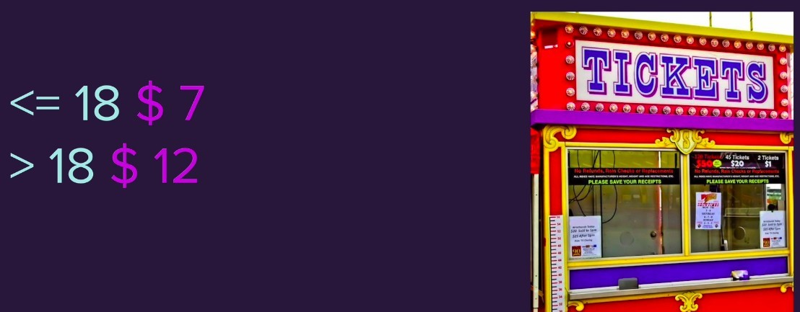
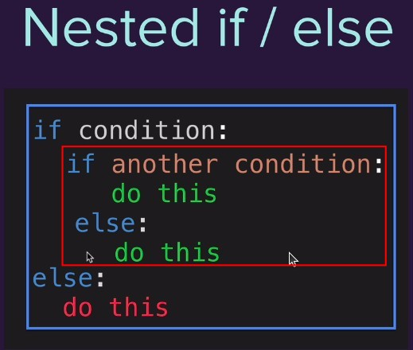
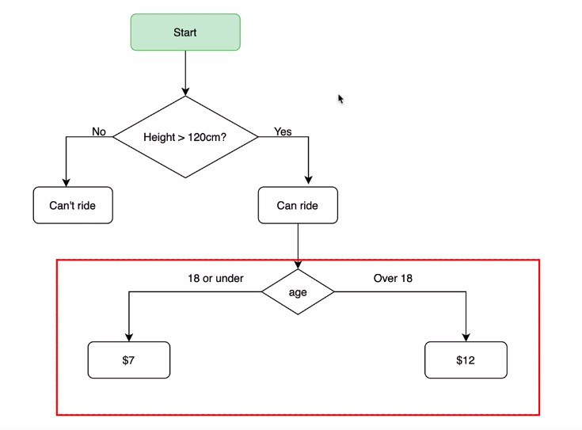
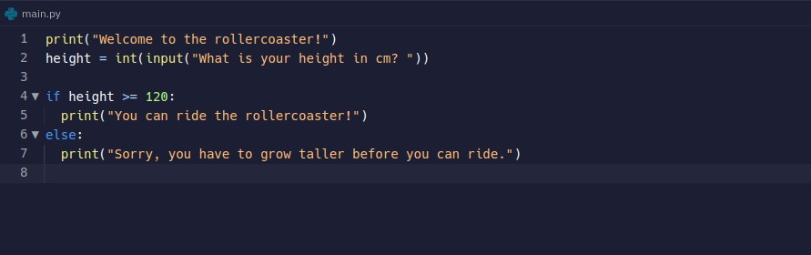
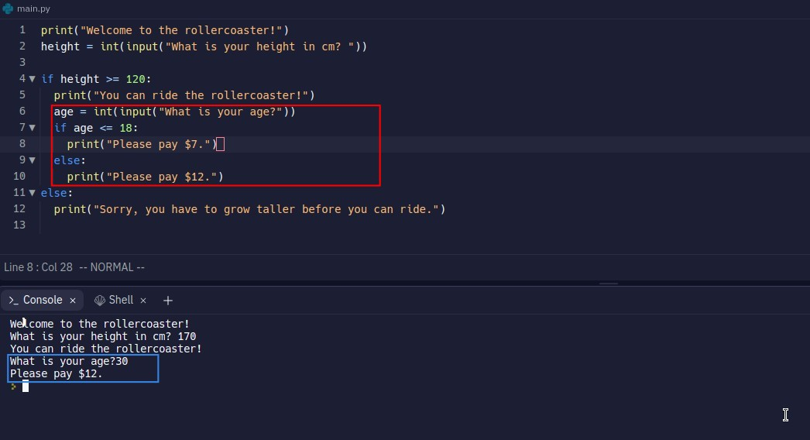
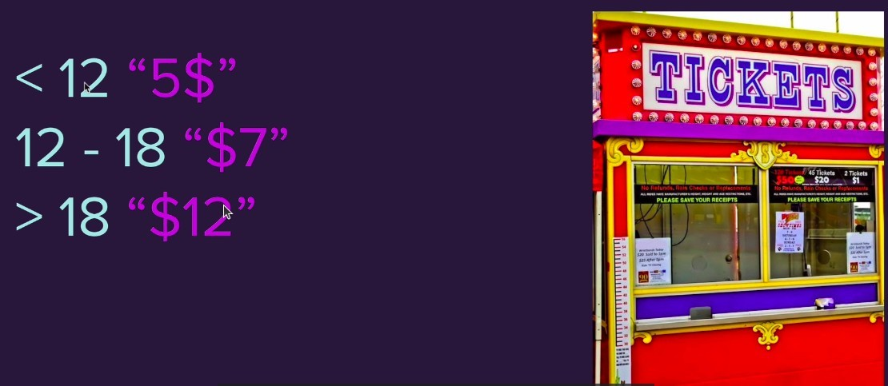
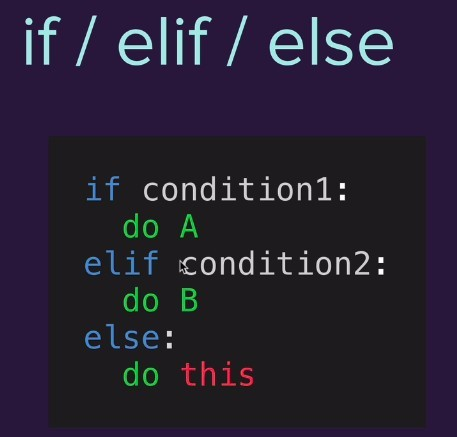
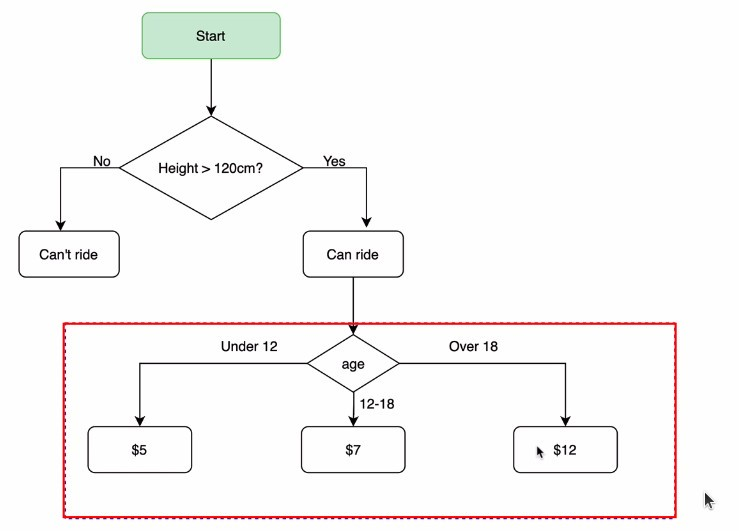
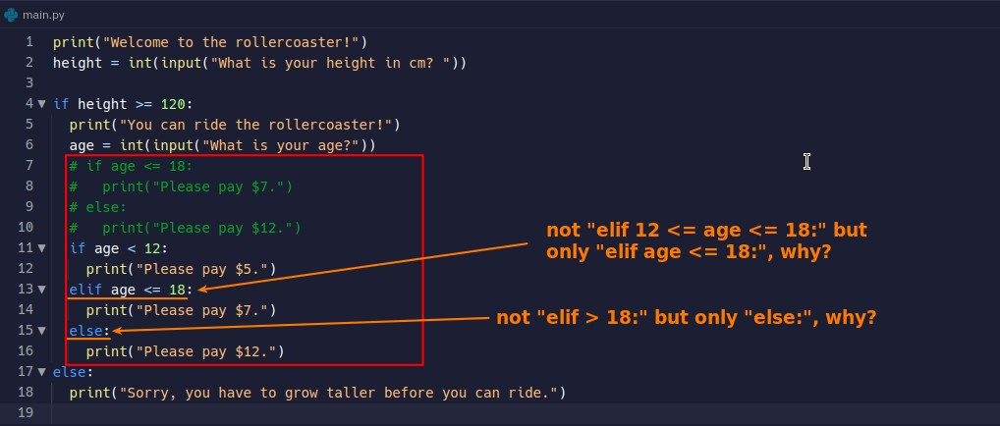

## **Further Ask for Tickets pay**

### _Add more asking for age_

### _nested if/else_

### _flowchart_

## **Nested if/else**

### _codes from last lecture_

### _solution_

## **More then 2-ways conditions**

### _Not only 2-ways results of condition_

### _elif_

### _flowchart_

- Although we see the three conditions on the horizontal line in flowchart, they are actually checked step by step in the program.

### _solution_

- Because the program is executed step by step from top to bottom, the condition at the bottom will contain the contents of the previously executed condition, so there is no need to write it repeatedly.
