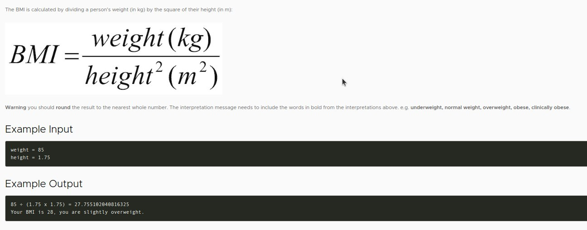
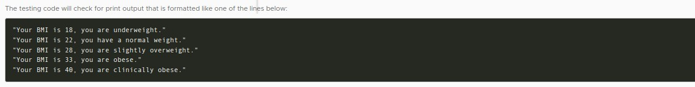
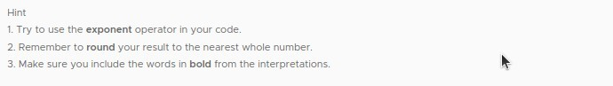
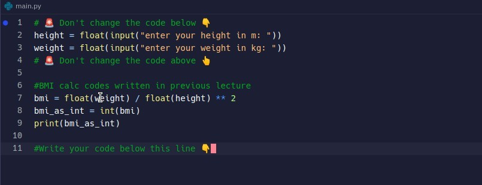
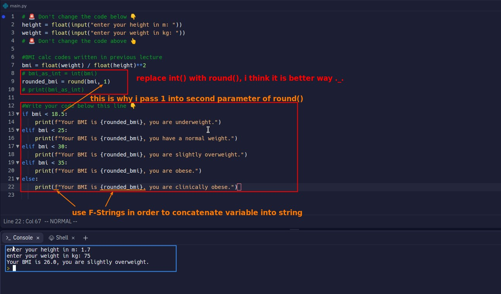
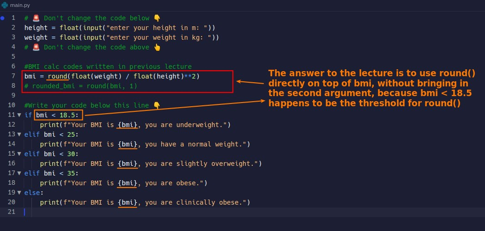

## **Exercise: BMI 2.0 (Give suggestion according to BMI)**

### _Instruction_

### _Hints_

### _Codes from BMI calc 1.0_

- In BMI calc 1.0, we calculate the BMI based on height and weight, and in BMI calc 2.0 we give appropriate recommendations based on this BMI.

## **Solutions**

### _My solution_

### _Lecturer solution_

- Because 18.5 is exactly the threshold value for rounding, we directly rounded the BMI without the second parameter, and the result will not have any mistakes.
