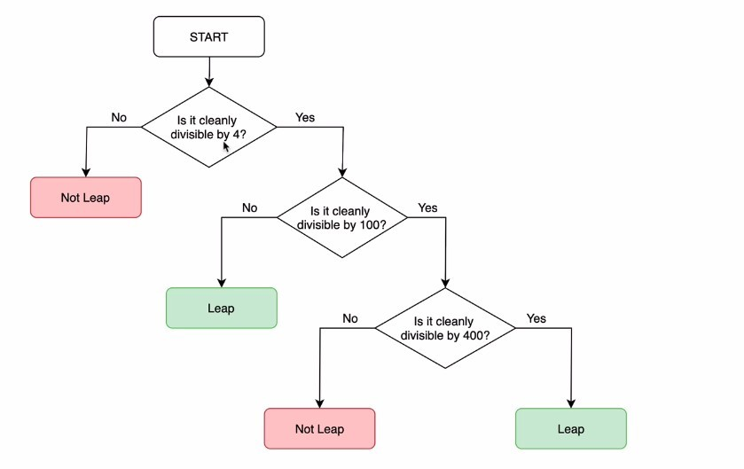

## **Exercise: Leap year**

### _Introduction_

- Sometimes understanding the customer's needs is the most difficult step.

### _Example input/output_

### _Hint_

## **Solution**

### _Flowchart by myself_

- I think being able to draw the right flowchart is even more important than codes.

### _Codes by myself_

## **Lecturer Solution**

### _Flowchart_

- I use codes directly to write the condition part, and the collector is presented in an oral way, I think different ways have their own advantages and disadvantages, there is no absolute good and bad.
- Lecturer uses color to distinguish between Leap Year and Not Leap Year to make flowchart more readable, which I can learn from.

### _Codes_

- There is almost no difference in the Codes section. I thought the lecturer would do some **refactor on the repetitive parts**, but there is none.
