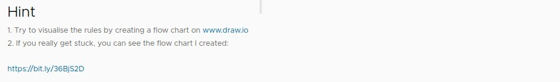

## **Exercise: Leap year**

### _Introduction_

- Sometimes understanding the customer's needs is the most difficult step.

### _Example input/output_

### _Hint_

## **Solution**

### _Flowchart by myself_

- I think being able to draw the right flowchart is even more important than codes.

### _Codes by myself_

