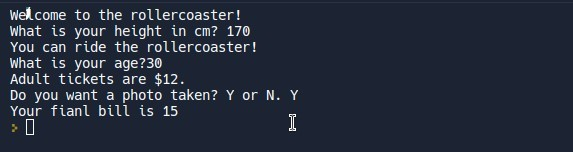

## **Additional asking: Photo or not?**

## **if/elif/else and multiple if**

## **Flowchart**

### _from last lecture_

### _Add photo or not and explain what is seperate if-statements_

### _Explain what is related if-statements_

## **Codes**

### _from last lecture_

### _Add if-statement_

### _Intermediate variable_

### _Path without actions_

### _console result_

