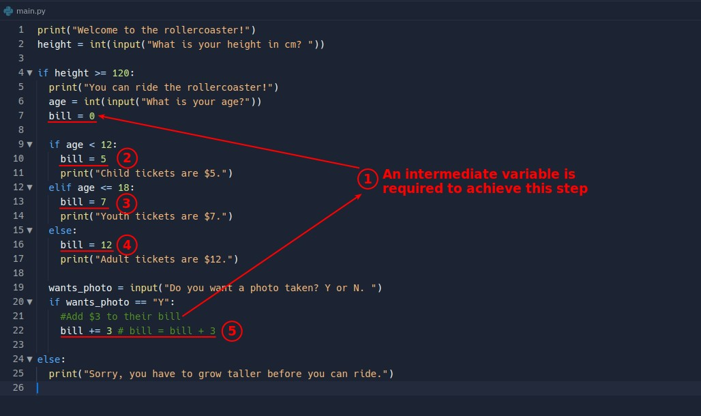

## **Additional asking: Photo or not?**

> Following the program of the previous roller coaster, this lecture then asks the guests if they want to take pictures.

- This problem is related to the first if-statement (height), but not to the second if-statement (age) (even if it is necessary to get its result to do the calculation)

## **if/elif/else and multiple if**

- The three if-statements in the "multiple if" on the right are unrelated to each other, so whatever the result of the previous if-statement is, it does not affect the execution of the subsequent if-statement.

## **Flowchart**

> The correlation between the if-statement above must be explicitly translated into flowchart.

### _from last lecture_

### _Add photo or not and explain what is seperate if-statements_

### _Explain what is related if-statements_

## **Codes**

### _from last lecture_

### _Add if-statement_

### _Intermediate variable_

### _Path without actions_

### _console result_

