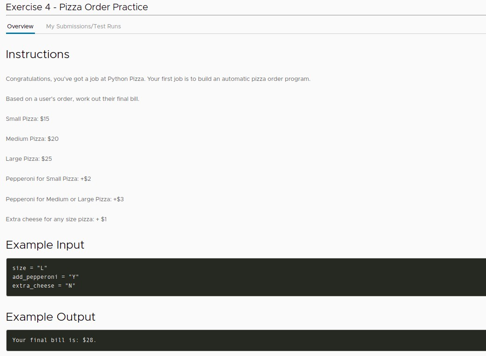
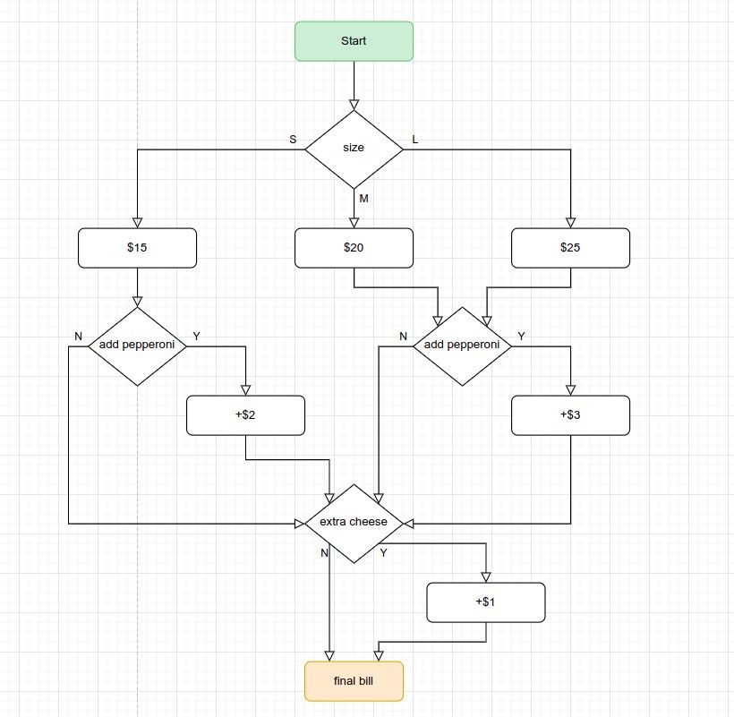
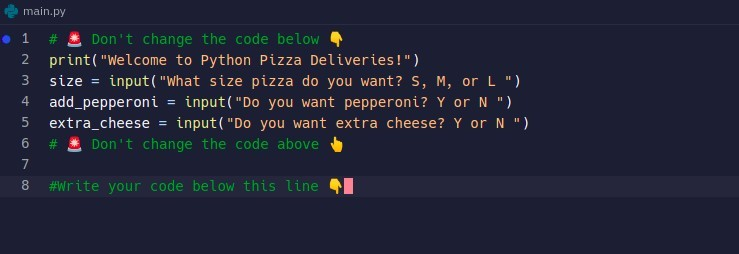
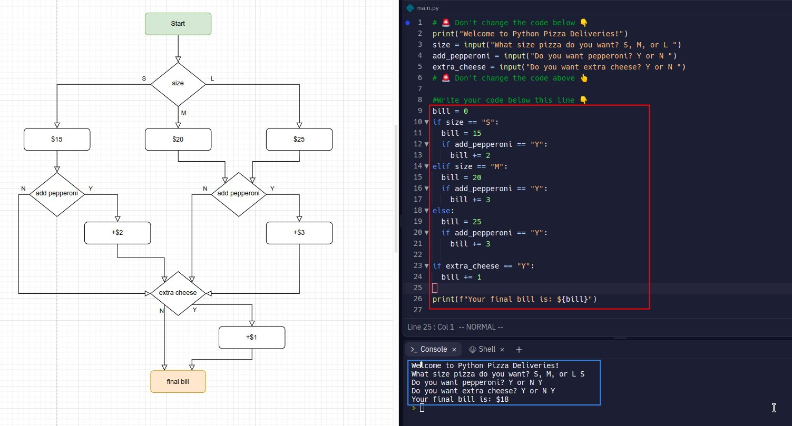
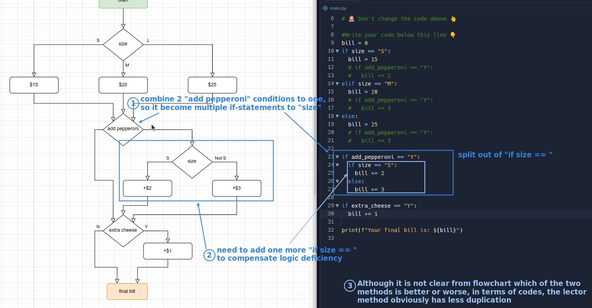

## **Exercise: Pizza Order**

### _Instructions_

### _Hints_

## **Solutions**

### _My flowchart_

### _My Codes_

### _Lector's solution_

- We prefer the conditions to be independent of each other, so that the codes written using multiple if statements are easier to read.

## **Conclusion**

> In flowchart, when you find that there are duplicate conditions but different actions depending on the result of the previous condition, how to convert them to non-duplicate conditions is the key point of this exercise.
