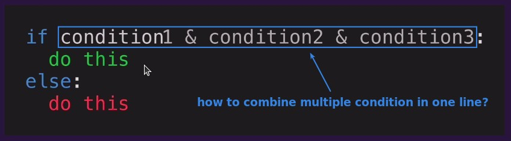
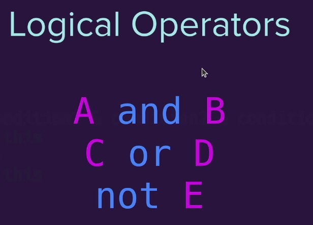
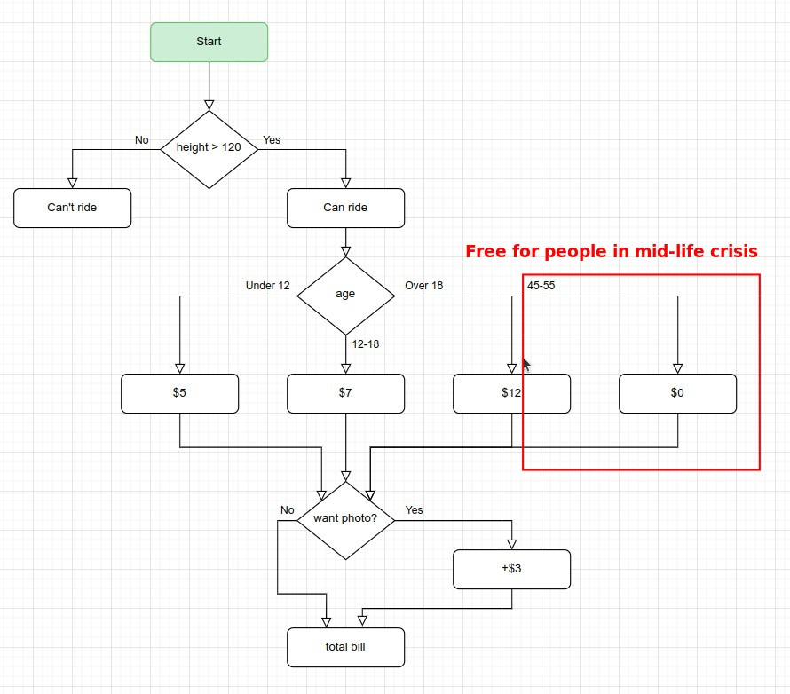
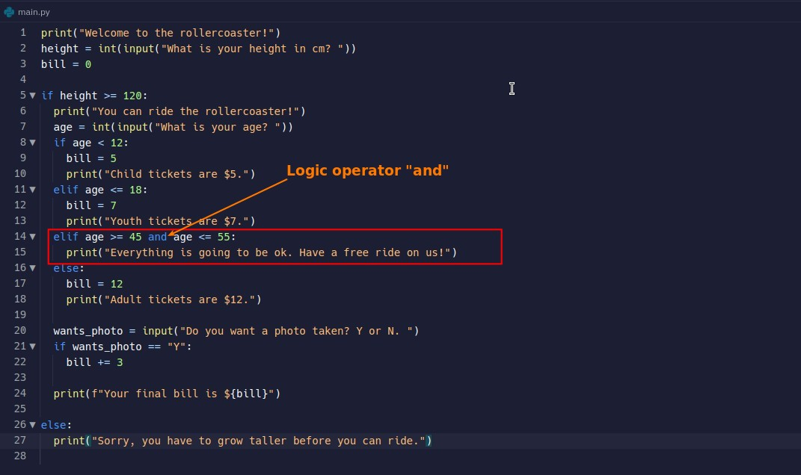

## **Combine multiple conditions into one**

### _sometimes we need to combine multiple conditionis into one_

### _we use logical operators to achieve it_

## **Example: Free rollercoaster rides for people in midlife crisis**

> We continue the previous rollercoaster case and add this new part.

### _Add into flowchart_

### _Add into codes_

