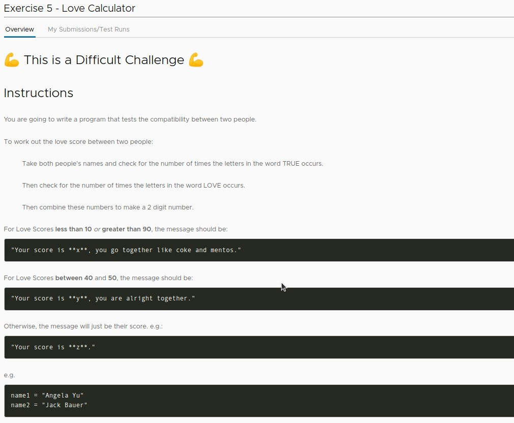
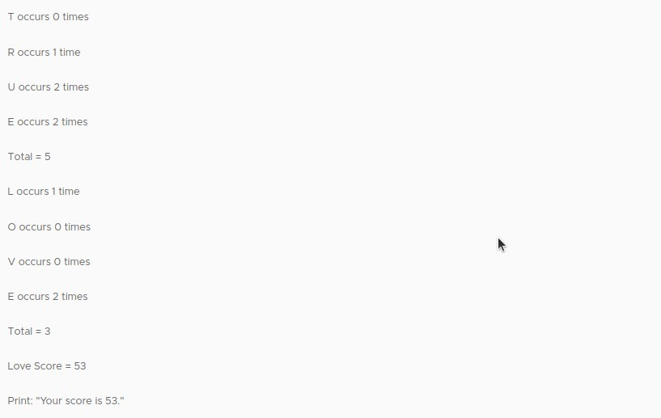
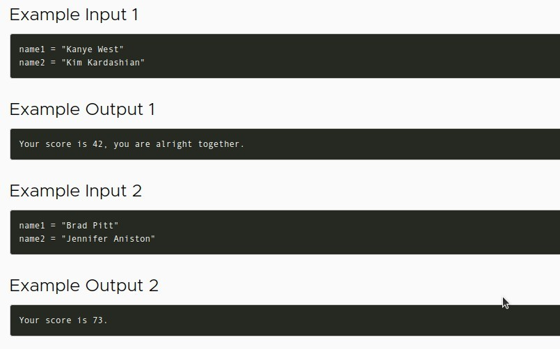
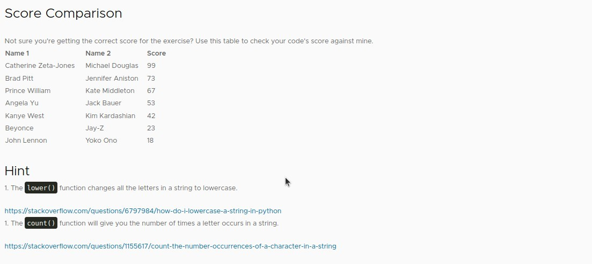
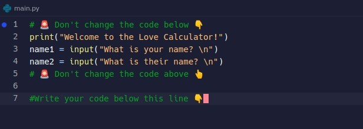
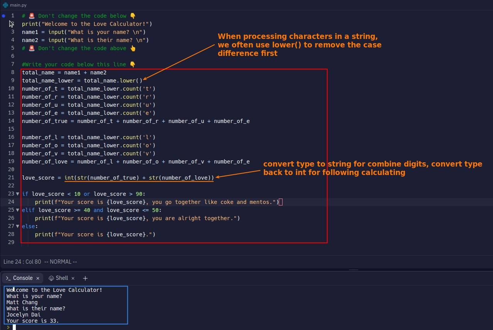

## **Exercise: Love Score**

### _Instructions_

### _Examples_

### _Score comparison and Hints_

### _Existed Codes in .replit file_

## **Solution**

- There are two stage:
  - 1. Calculation of the score.
    - Needs to know how to lower string and count words.
  - 2. Different suggestions for different score ranges.
    - Only simply logic operators test.
