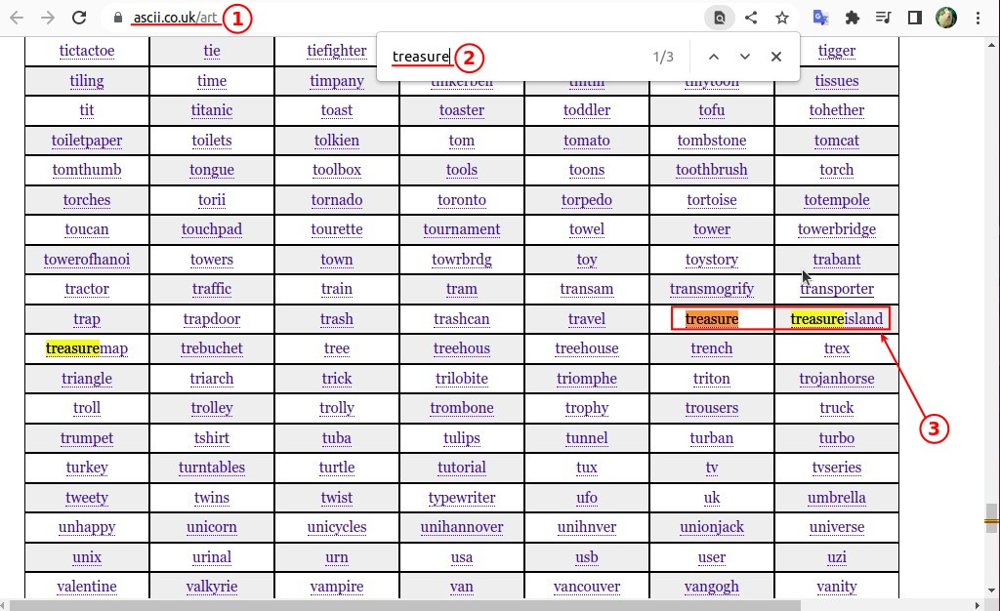
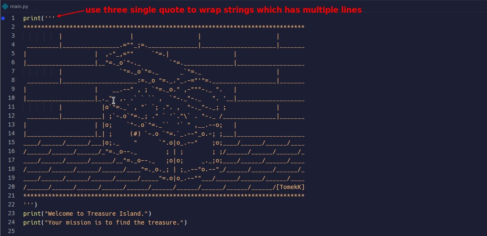
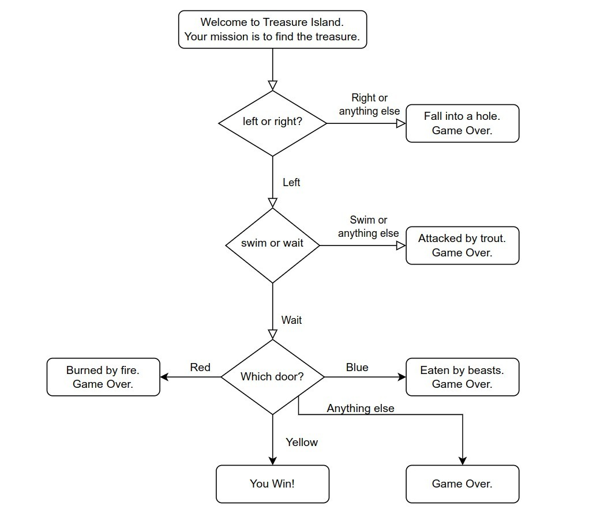
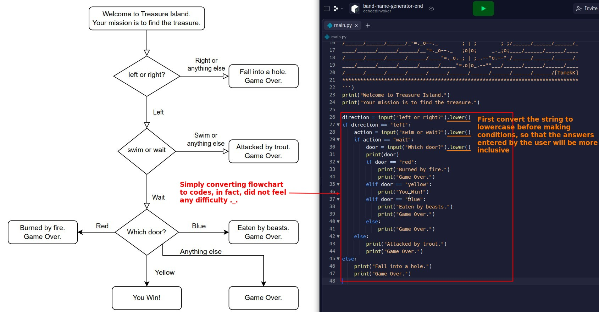
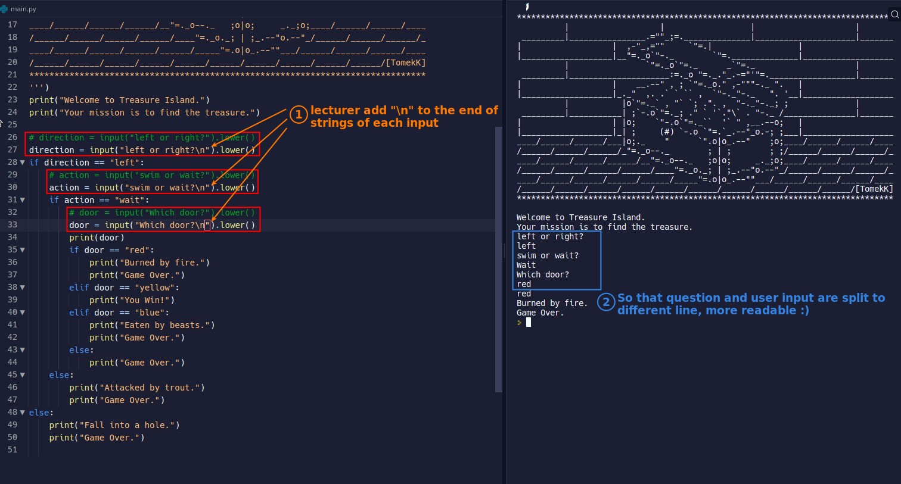

# **_Project: Treasure Island_**

## **ASCII Art**

### _Check ascii art_

### _Use ascii art in our game_

## **Lector's Flowchart**

> Lector has drawn the flowchart of the game for us, just turn it into a program, of course, you can also add your own game content.

## **Codes Solutions**

### _My solution_

### _Different from lector's solution_

- Lector adds "\n" at the end of each input string so that the user input will not follow the question but on the next line, making the game text more readable.
