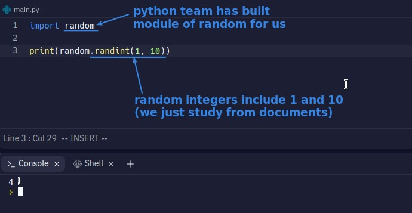
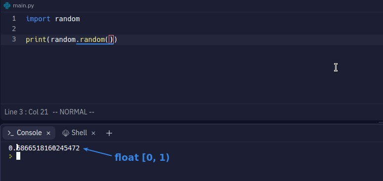

## **What is module?**

> When we have more and more codes, the whole script will become difficult to understand, then we will write different parts of the function in different modules, usually a module only focus on doing one thing.

## **How to use module**

## **AskPython**

> This site is about the documentation of the module made by the Python team.

## **Random number**

> Just as we can use google search without understanding the google search algorithm, we can use Python's random modules without knowing how they write codes behind the scenes.

### _random integers_

### _random float_

### _random float in a specific range_

- The range generated by the original random() is [0.0, 1.0), which becomes [0.0, 5.0) when multiplied by 5.
