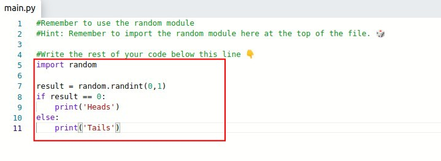

## **Exercise: Heads or Tails**

- Simulating a pitch coin produces either head or tail results.

## **Solution**

- The main point is that we need "two" results, we can use integer [0,1] which is also two results to implement it.
