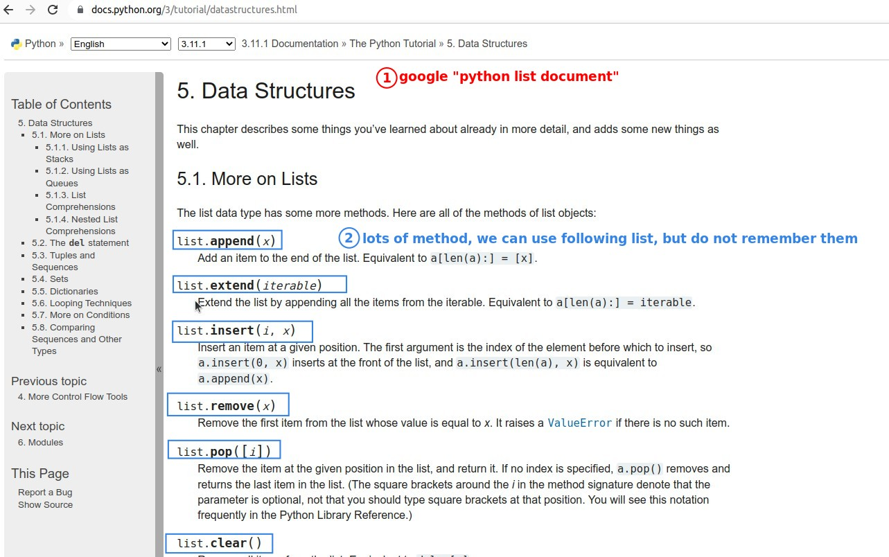

## **What is data structure**

- Data structure is the method of data organization and storage, a numeric value or a string can also be said to be a data structure.

## **Data structure: List**

> If we wanted to save every state in the US to the variable, we would probably use the following with our known way.

- But this is a bit strange, because each state string is one of the US states, and they are related to each other, but there is no way to show this relatedness with such a storage method above.

- So we have another data structure to store a series of related values, which is the list.

## **Order of List**

> List is a sequential data structure, we can read the values in positive order or reverse order.

- JavaScript array cannot read the elements in the array directly using the inverted index, you have to use Array.prototype.at to use the inverted index, which is different from Python list.

## **Methods of List and Official Documents**

- There are a lot of methods under the list that can be used, we don't need to remember them specifically, but we must be familiar with how to query the documents.

