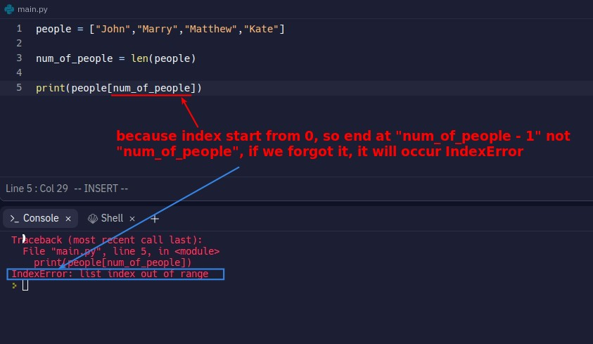
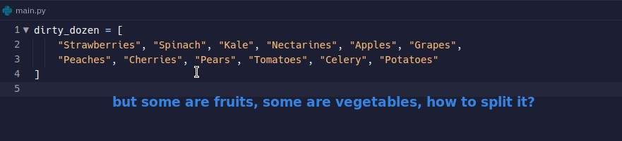
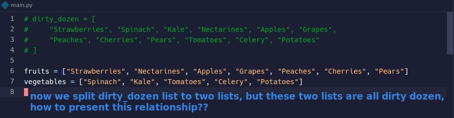
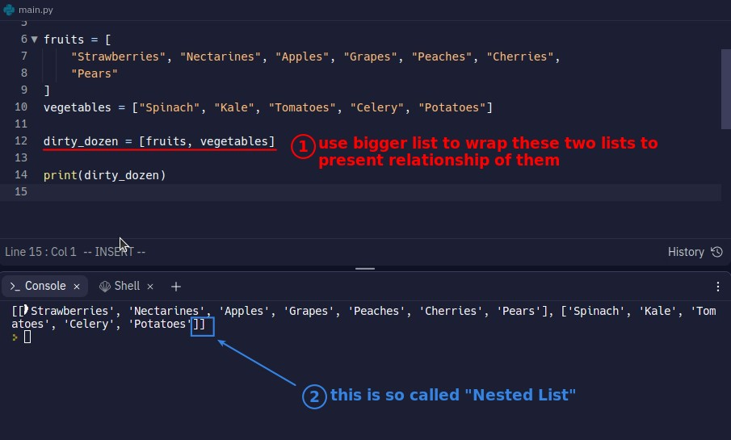

## **IndexError**

- In addition to the above example, IndexError can easily occur when our program becomes more and more complex or when there is too much content in the list.

## **Split one list to multiple lists**

## **Wrap multiple lists into one list**

- So from the above, we can find that whether we want to use a nested list or a list itself depends on the associativity of the elements in each layer of the list.
  - Don't forget that the data structure of a list exists to express that the elements in it are related.
