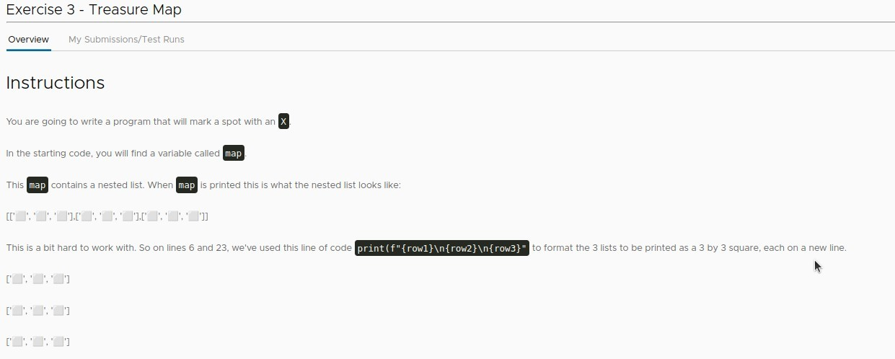
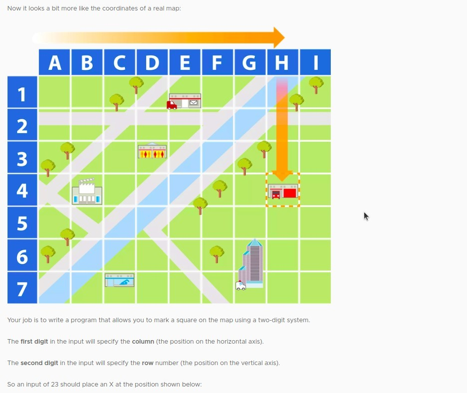
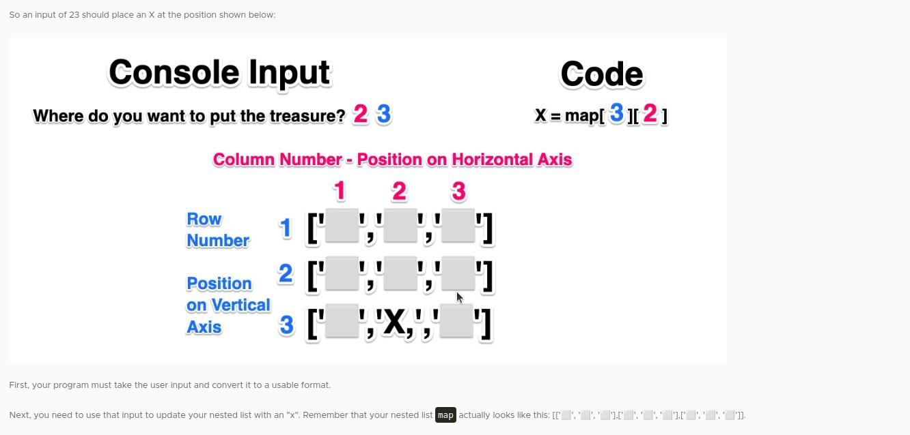
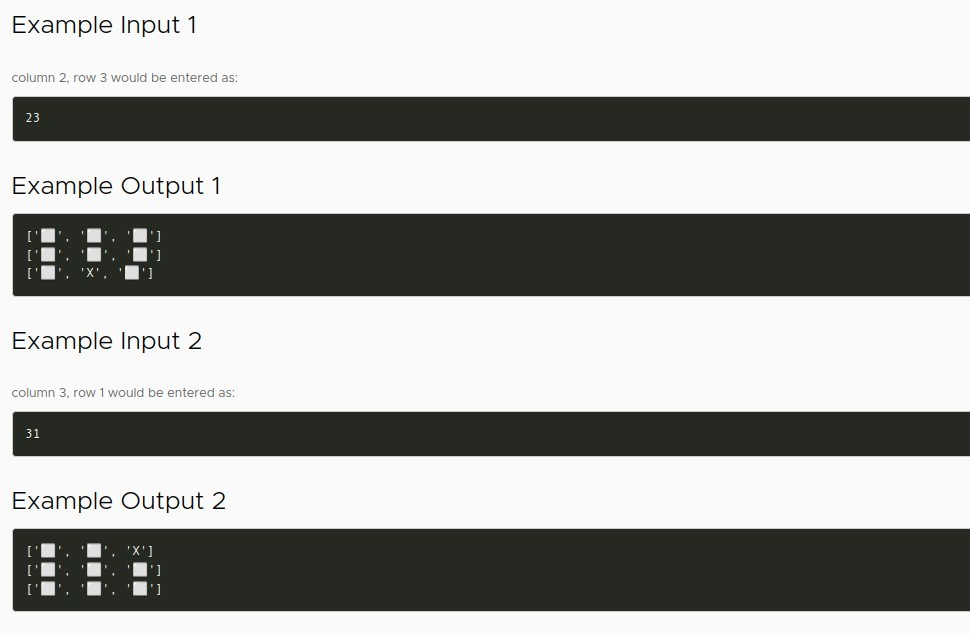
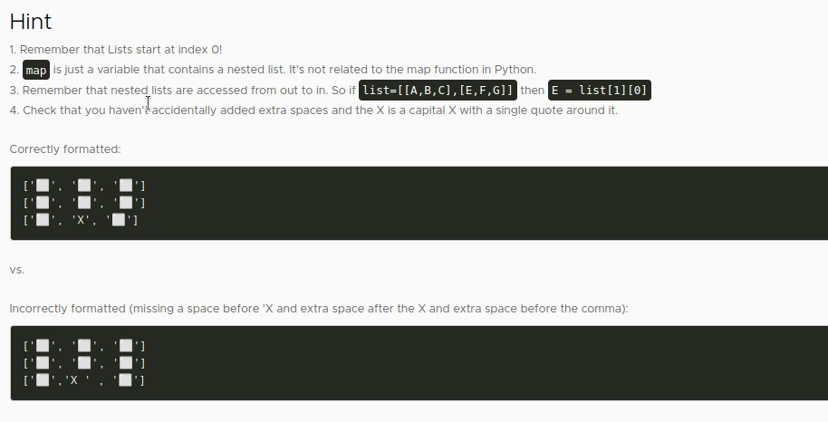
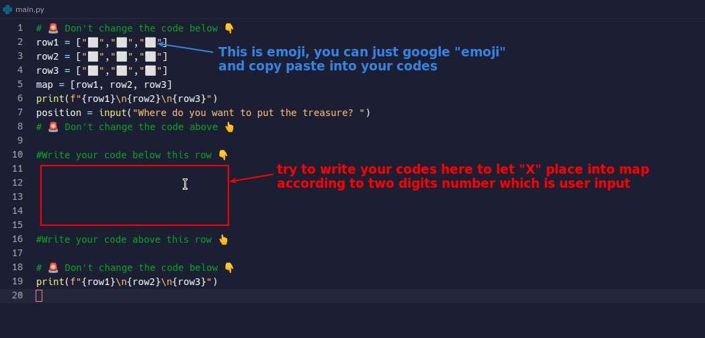
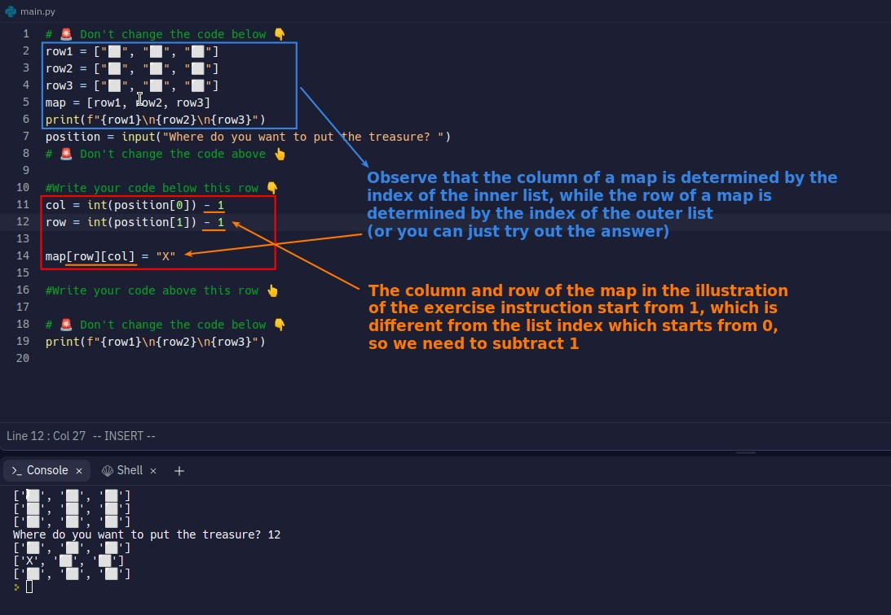

## **Exercise: Treasure map**

> Allows users to enter two digits to mark "X" to the corresponding position in the 3x3 map.

### _Instructions_

### _Map_

### _Input/Output example_

### _Hints_

### _Existed codes in replit file_

## **My solution**

