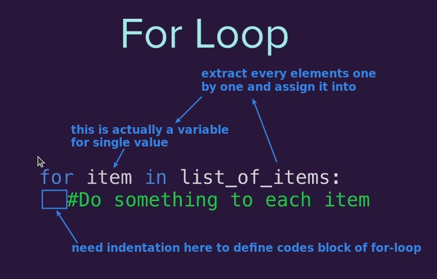
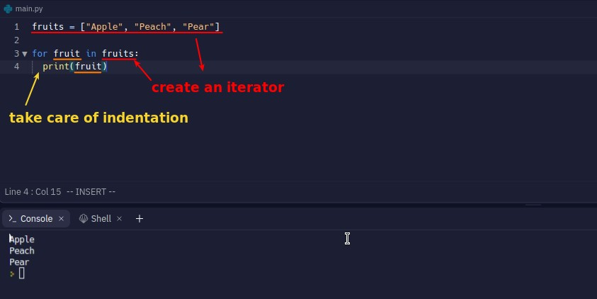

## **for loop**

## **example**

- After the keyword "in" must be iterator, list is also a kind of iterator.
- In front of the keyword "in" is a custom variable name to hold the value extracted from the iterator for use in the codes block.
