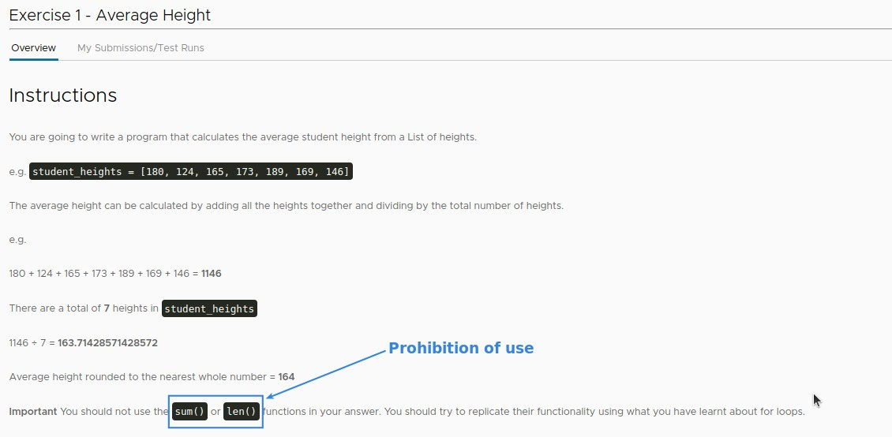
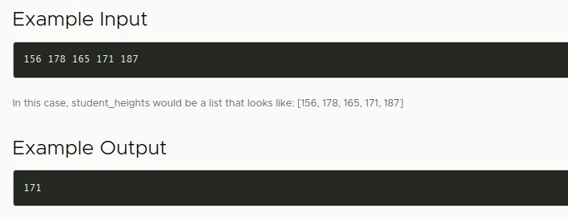
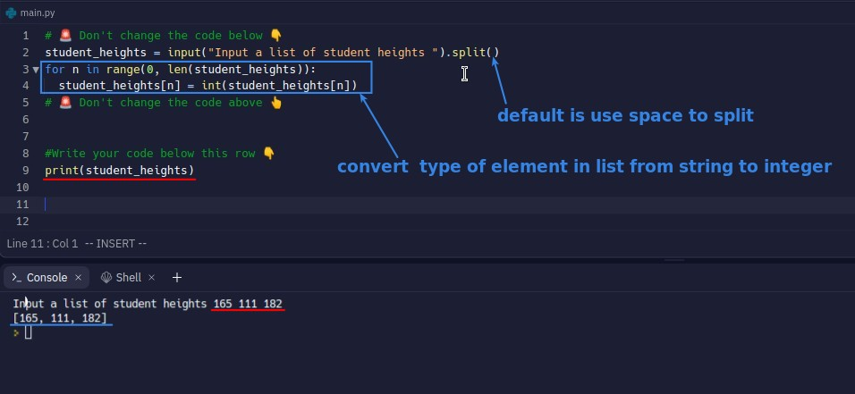
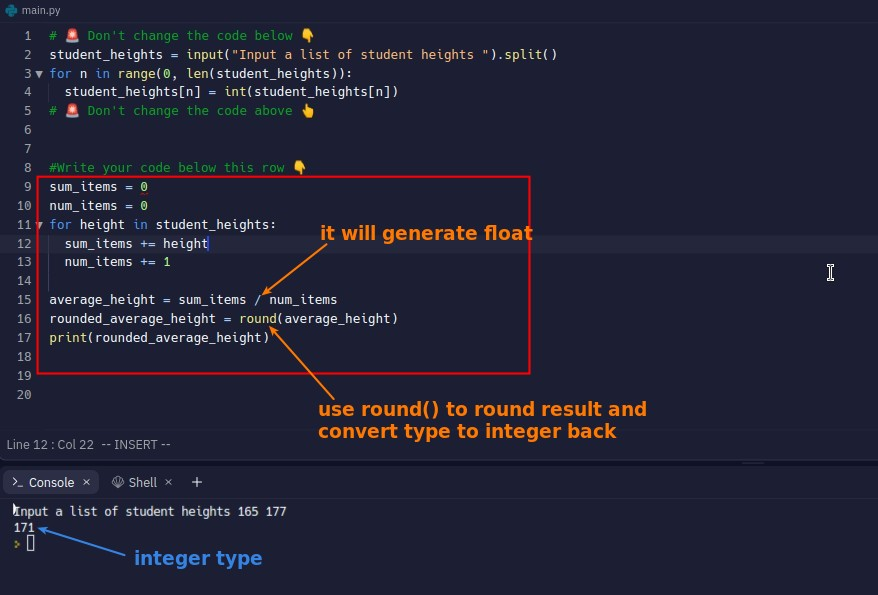

## **Exercise: Calculating average height**

### _instructions_

### _input/output example_

### _hint_

### _existed codes in replit file_

- Lector has helped us to solve the input part and convert the values in the list to integer type.

## **My solution**

