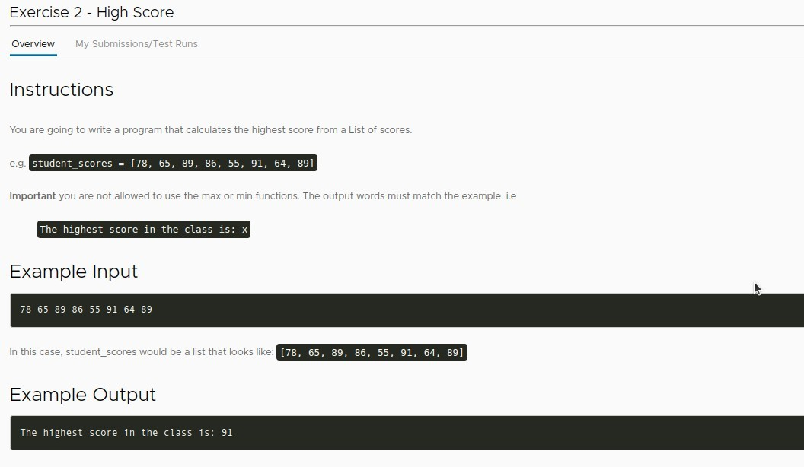
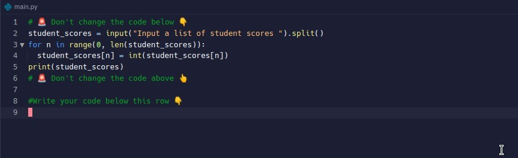
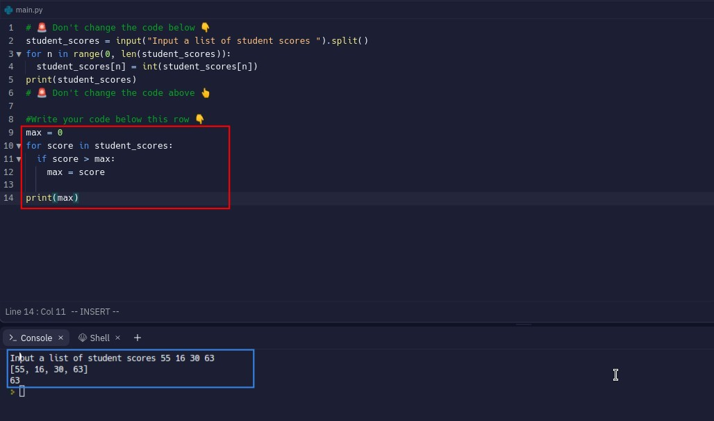

## **Exercise: Find Highest Score**

### _Instructions and inpu/output example_

### _Hint_

### _Existed codes_

- Because python is often used in calculations, it provides many very convenient functions such as max() that can be used directly to solve this problem.
  - But we may not have these convenient functions when converting to other languages, so lector wants us to be able to complete the problem without using max().

## **My solution**

- The variables that need to be culculated in loop, if it is number type(integer or float), set initial value to 0 outside the loop is a very common practice, if it is not fit to the requirements of the topic then you need to use other initial value to deal with it.
