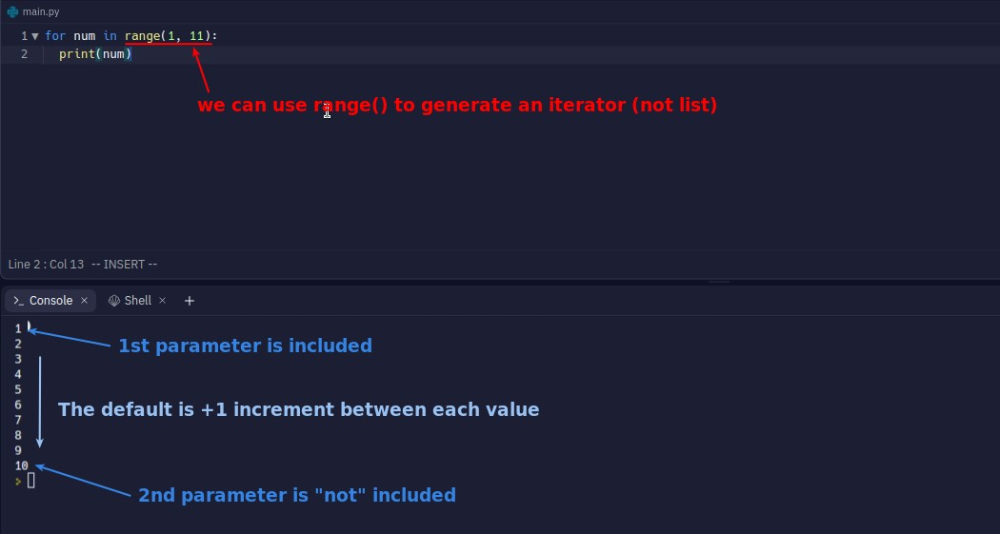
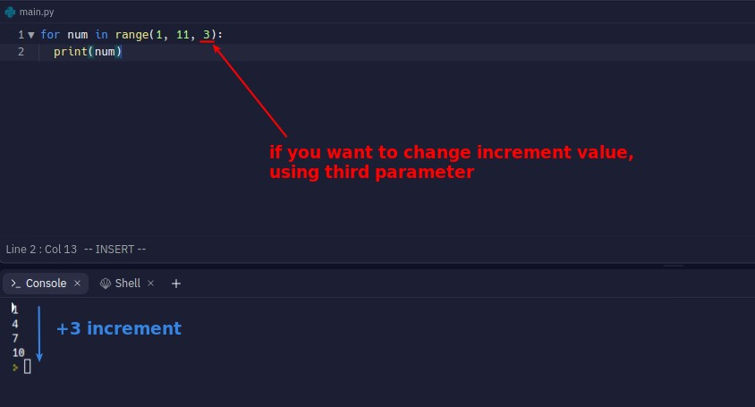
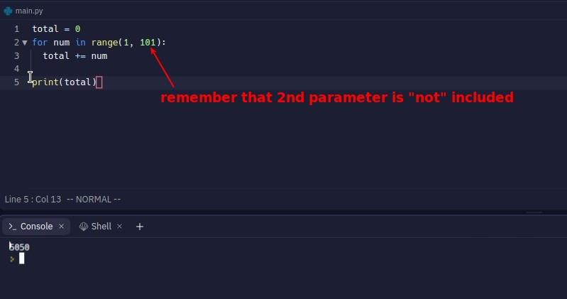

## **Use range() to generate iterator to loop**

- Note that range() generates a special kind of iterator and not a list.

## **Set custom increment for range()**

## **Solve guass problem**

> It is the problem of adding from 1 to 100.

