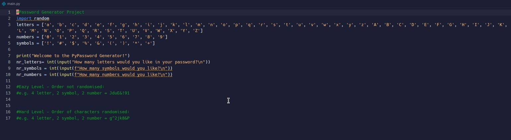
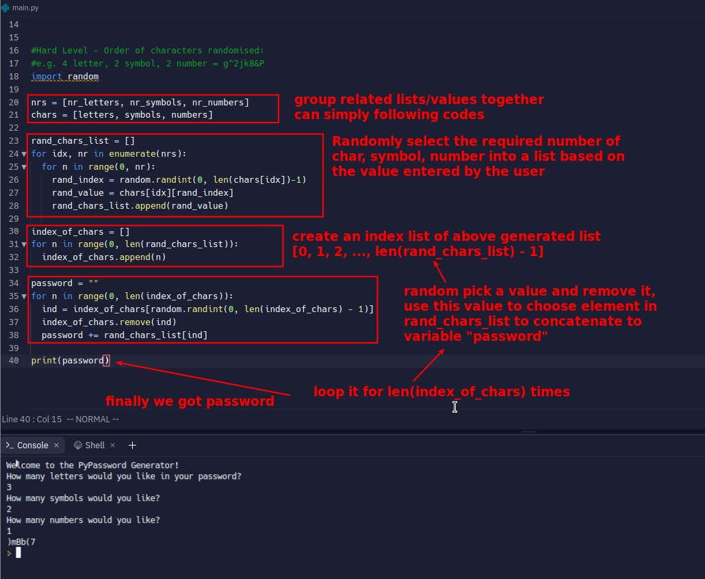
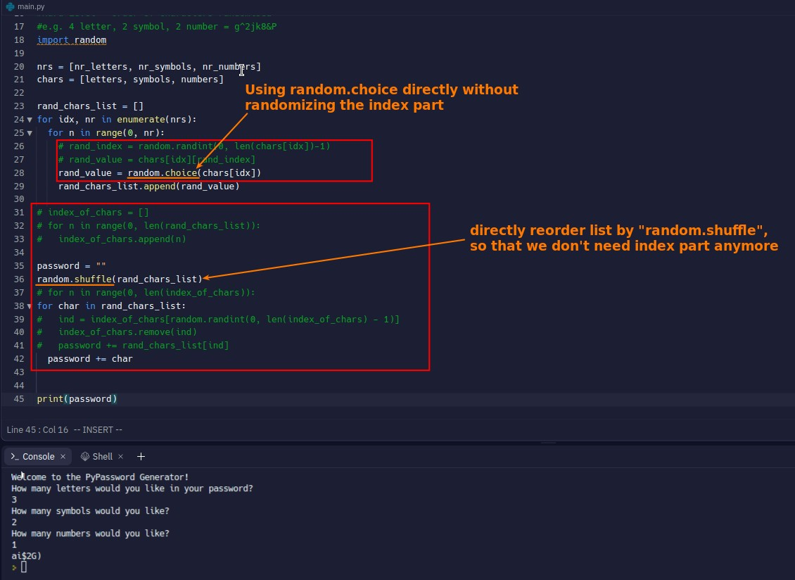

## **Project: Create a password generator**

> Create a code generator that can be customized according to the number of letters, symbols, and values required by the user.

- Lector has already written part of the code for us.
  - The basic data we need to use
  - User input section.

## **My solutioni**

## **Compare to lector's solution**

- For many parts of the list that require random sampling of the index, there are simple functions that can replace, such as "random.choice" and "random.shuffle".
  - I didn't find these functions because I wasn't sure what keywords to use to search, such as "reorder".
- Is there any part I did better than lector?
  - I have wrapped the associated list or value into a new list.
    - So the codes in my lines 24 - 29 are much more concise than the codes in the lector video, but they are nested for loops, which are less readable.
