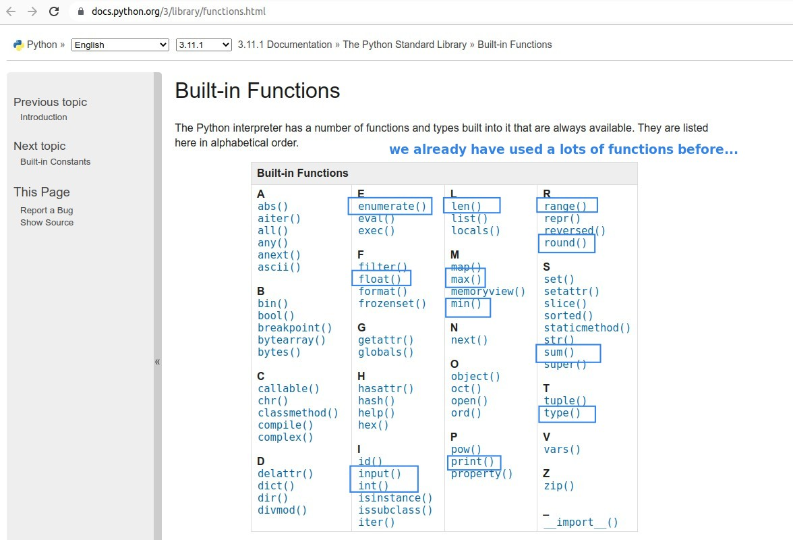
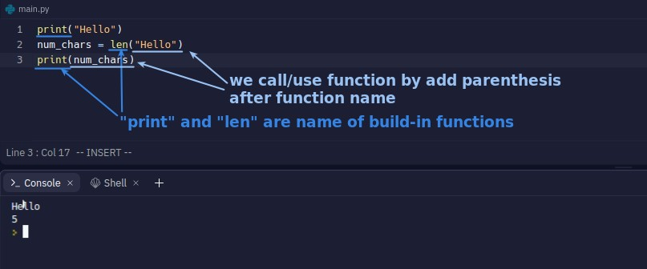
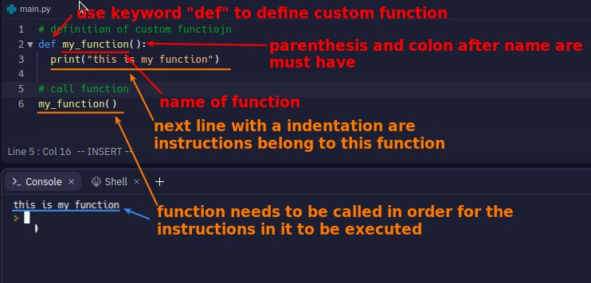
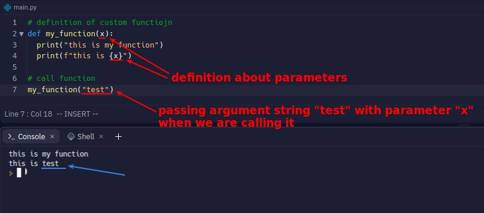
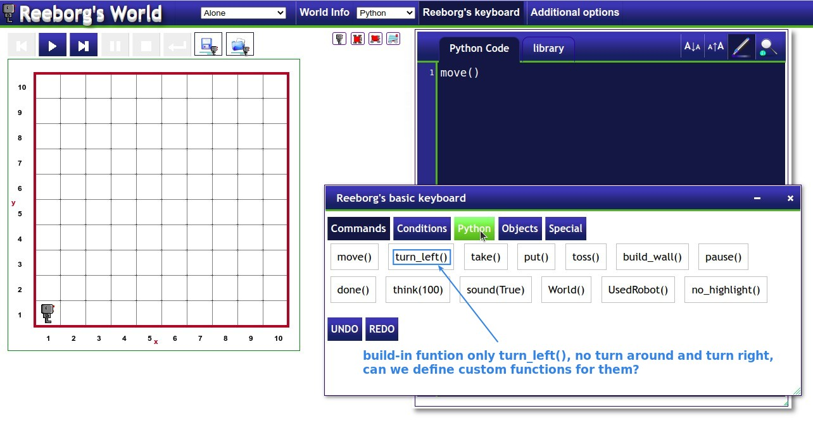
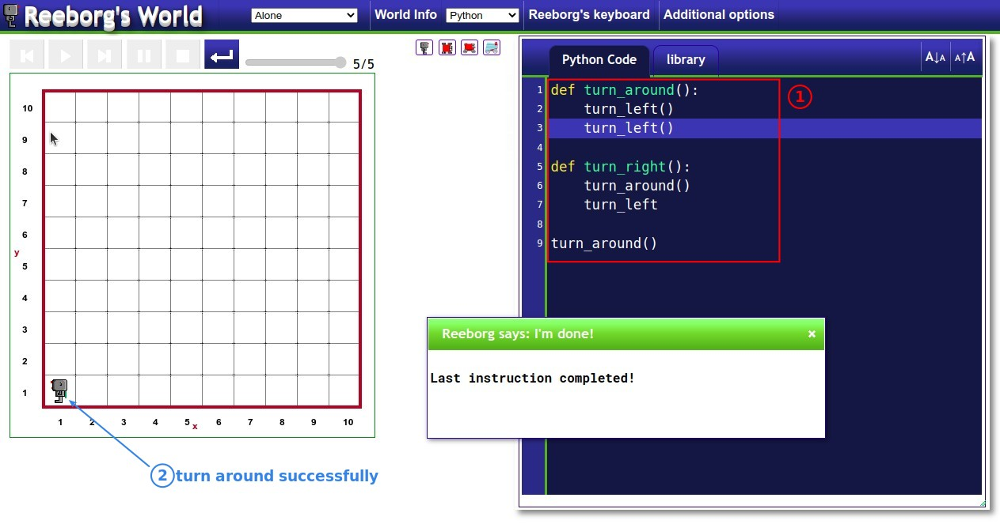
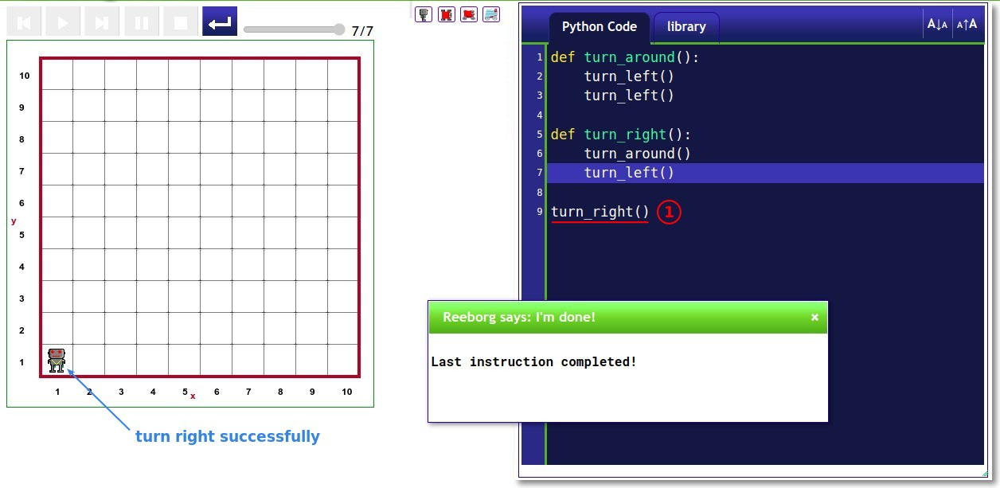
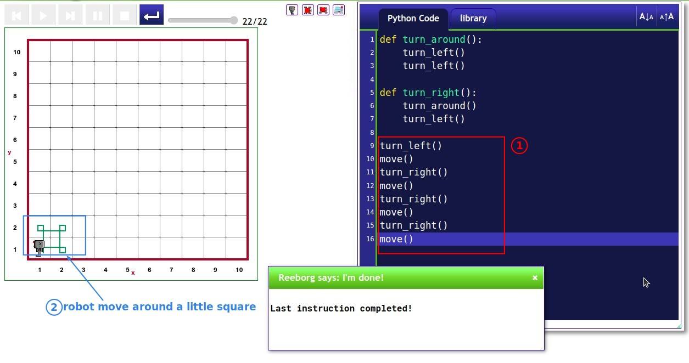

## **Build-in functions**

## **Custom function**

### _Define/Call(Use)_

- Define function does not execute its own instructions; you must call the function to execute the instructions belong to it.

### _Parameter/Argument_

## **Reeborg's World**

### _Problem of Reeborg's Robot_

- The robot's built-in turning function is only turn left, no turn around and turn right function.

### _Create functions for turning around/right_

> So we define turn around and turn right functions by ourselves.

### _Draw a little square with the robot_

> Try to use the robot to walk out of the path of a small square clockwise.

- We use custom turn right function to save a lot of code.
