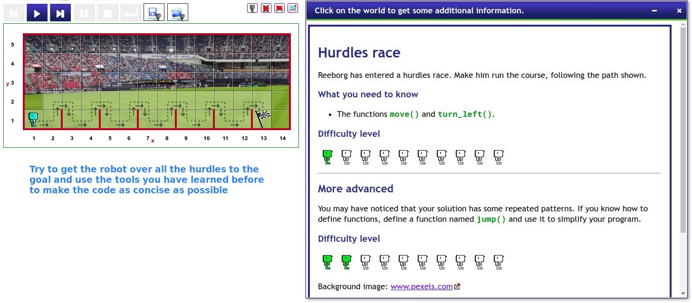
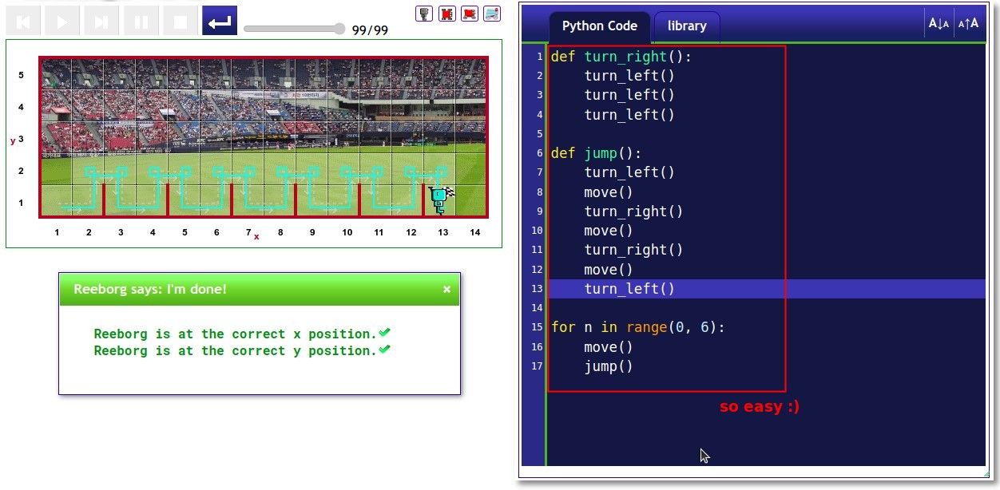

## **Exercise: Hurdles**

## **My Solution**

- Using the tools learned previously, it is natural to...

  - Use another function within a function.
  - Using function in a for loop.

- Lector's solution is similar to mine, the only difference is that she defines move() in the jump() function as well.
