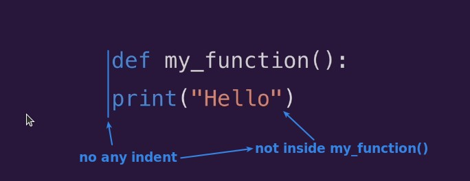
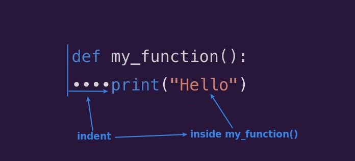
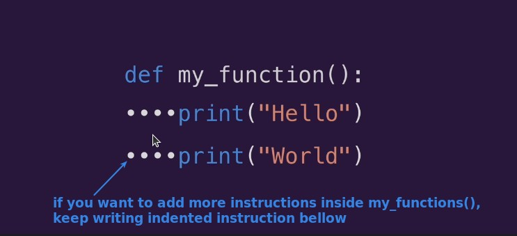
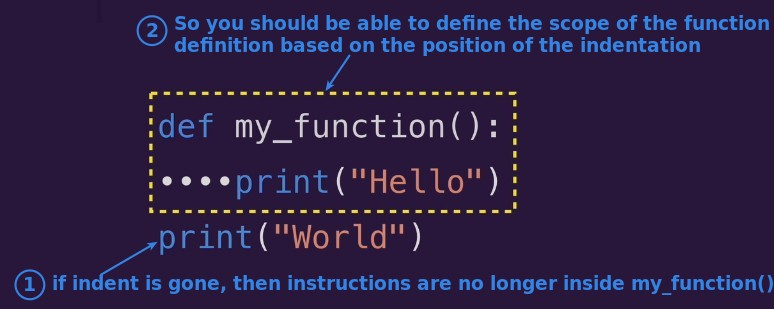
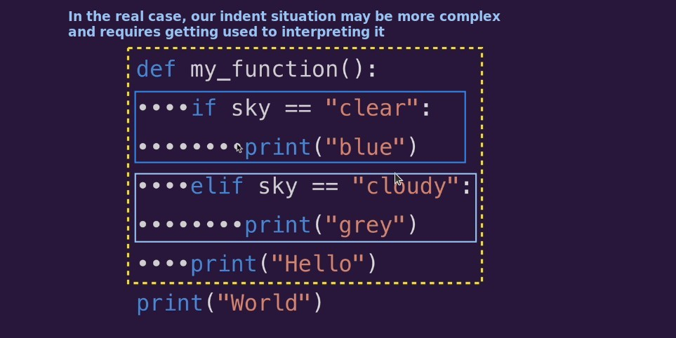
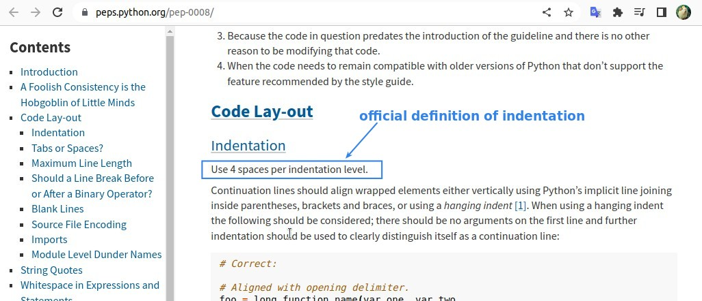
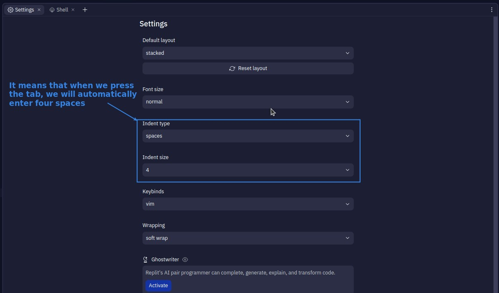

## **Indent**

## **Multiple Instructions and Indent**

## **Complex/nested indent**

## **How to indent? Tab or spaces?**

- In practice, mixing space and tab is forbidden in Python3, so explicitly specify indent = 4 spaces.

- However, most IDEs or text editors have a capability to automatically convert Tabs to spaces, so we can still use Tabs for indentation when writing programs.
