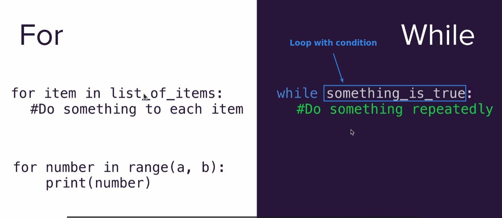
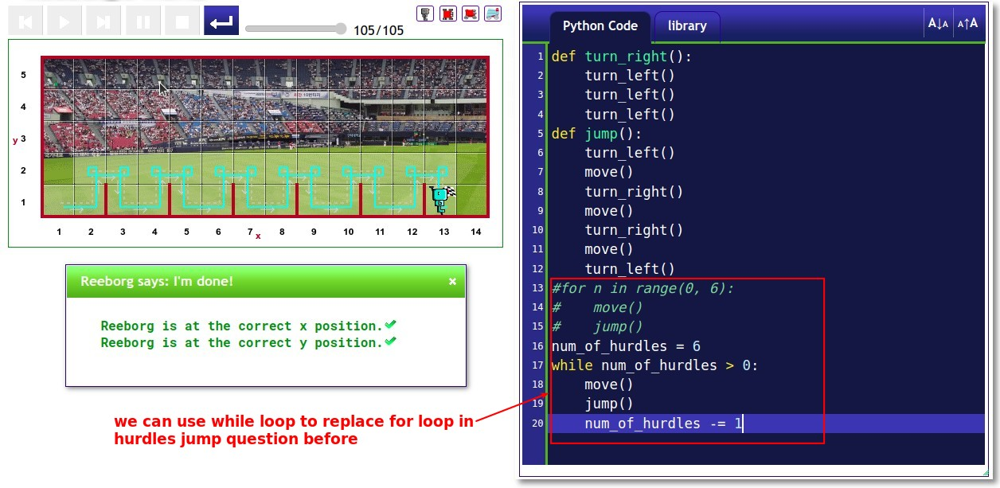
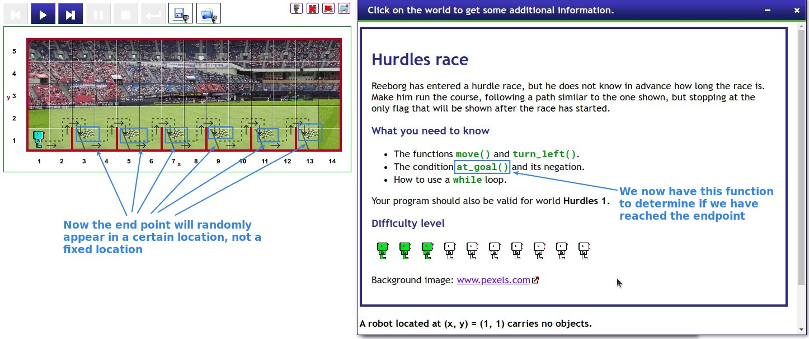
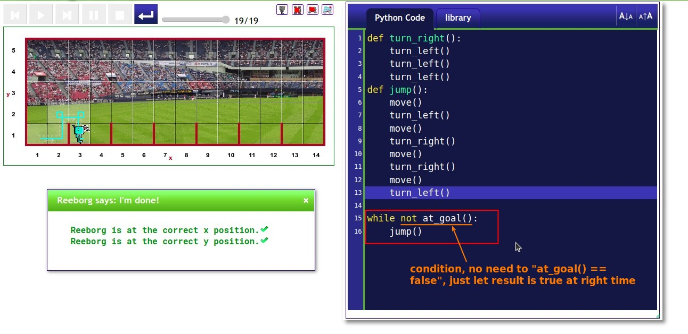

## **For loop vs. While loop**

- When there is a loop requirement, which one should be used?
  - Use for loop if you need to iterate over elements in a list or if you have a fixed number of executions.
  - If the loop executio depending on the condition, use the while loop.

## **Replace for loop in hurdles exercise(before) with while loop**

- From the above, it can be seen that for loop and while loop are interchangeable, the point is to transform iterator into condition.
  - But the question is, is there a need? Above, in order to convert iterator to condition, we have made the code more complicated, I don't think this is necessary.

## **Hurdles Exercise with random end point**

### _Instruction_

### _My solution_

- This example is based on the condition of whether or not the end point has been reached to determine whether or not the loop will be executed, so it is appropriate to use the while loop to complete.
