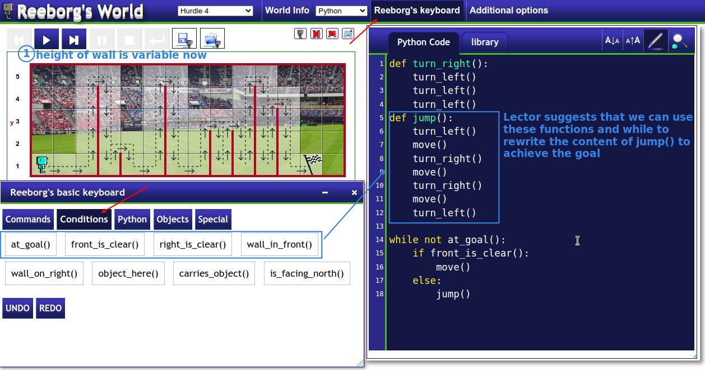
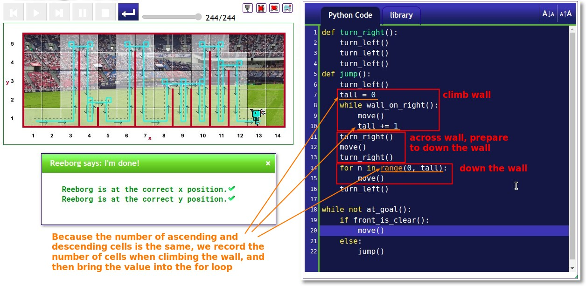
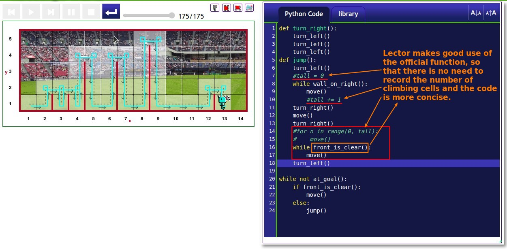

## **Exercise: Hurdles with variable heights**

## **Solutions**

### _Mine_

### _Compare to Lector's_

- I am too proud of finding the logic, and leave the existing good tools unused, this is where I am worse than Lector.
