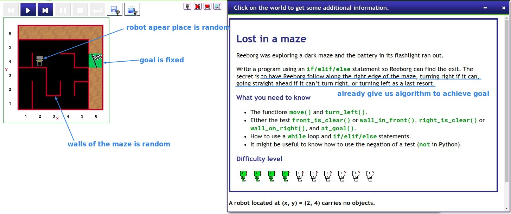
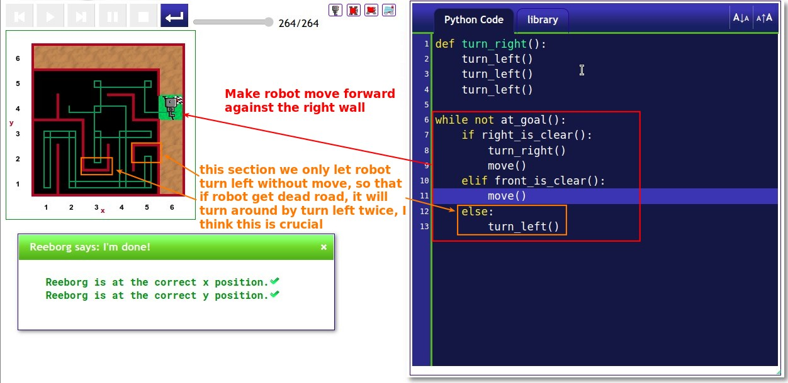
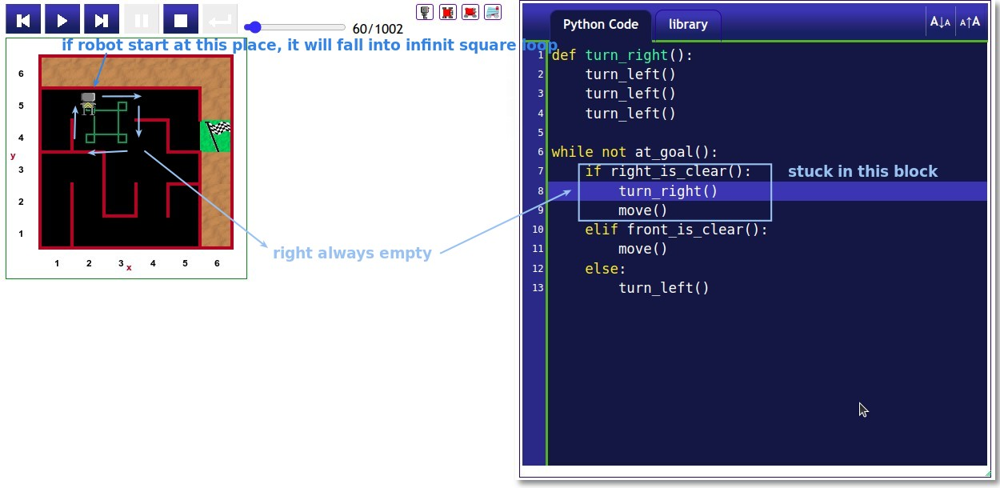
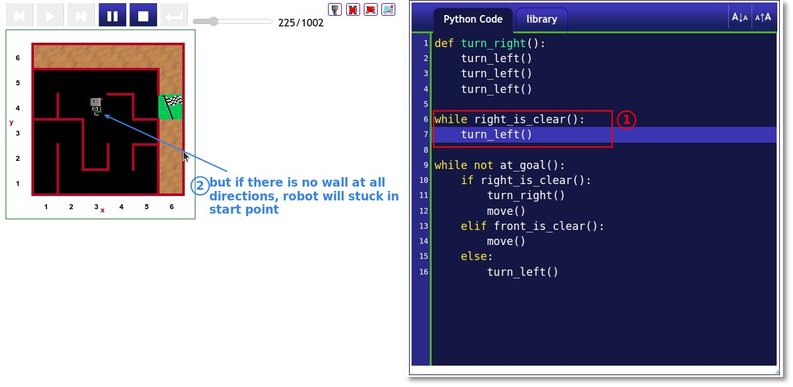
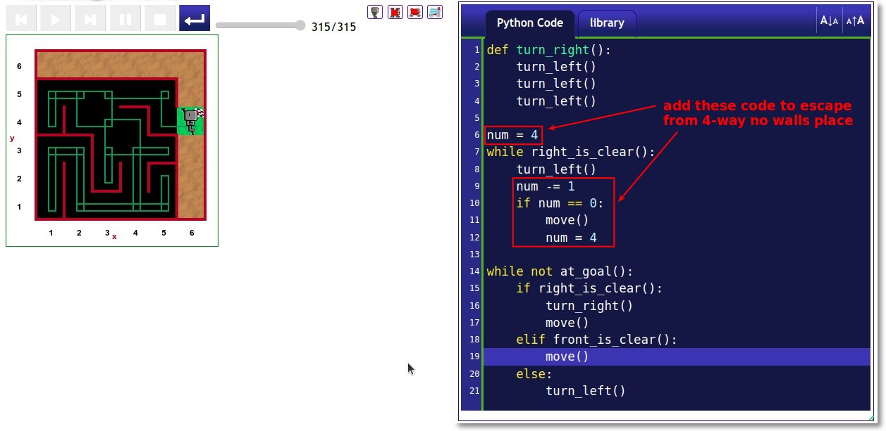
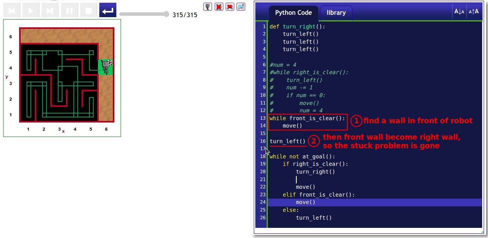

## **Challenge: Lost in the Maze**

## **Solutions**

### _My solution_

### _Middle Test_

> Once we have solved the problem, it is best to test it several times before we can be completely sure that there is no problem.

- When the robot starts in certain positions, it will be caught in a loop where there is never a right side wall to follow.

- I simply use the turn left method to move the wall to the right above, but if the starting position is not connected to any wall, turn left no matter how many times is never able to find the right side wall to follow.

- So I added a variable num = 4 to determine if there are no walls connected, and if so, move out of this position.

### \_Compare to Lector's solution

- Lector uses a completely different mindset about escaping start stucked place than mine, which encounters no difficulties, so the codes are simpler and much better than my way.
  - But it does not mean that my ideas are useless, the process of continuous improvement idea is also a kind of learning, but sometimes it may be necessary to jump out of the original thinking with a completely different way and ideas to solve the problem will be better.
