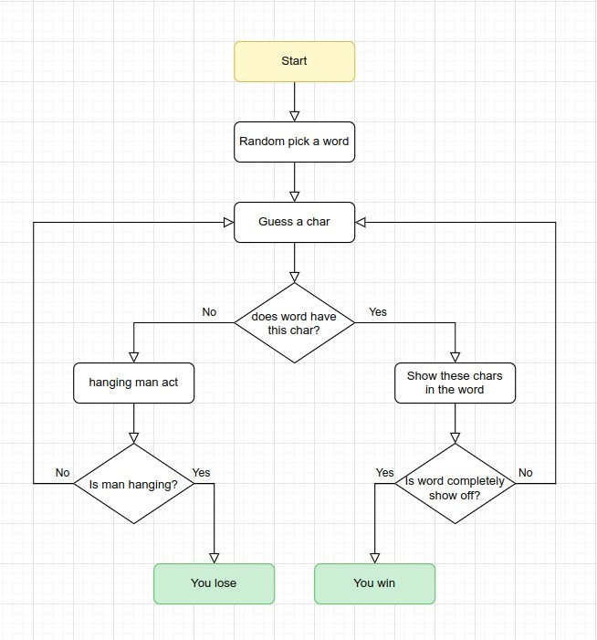
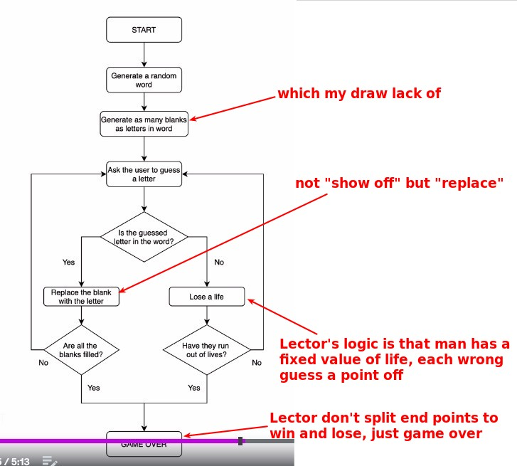

# **_Hangman_**

## **Try to draw flowchart by myself**

## **Lector's flowchart**

- There are some parts that are a little different from mine in terms of description:

  - "show off" -> "replace"
  - step by step to hang -> off a point of life

- The way Lector is described is easy to think of how to implement it in code.
  - Therefore, when we make the flowchart, we do not simply draw the process, but also think about the ease of implementation in the code based on this flowchart.
