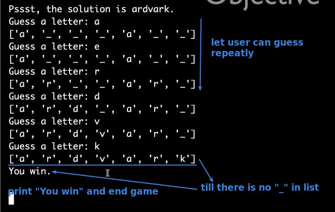
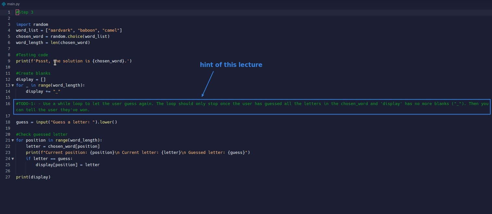
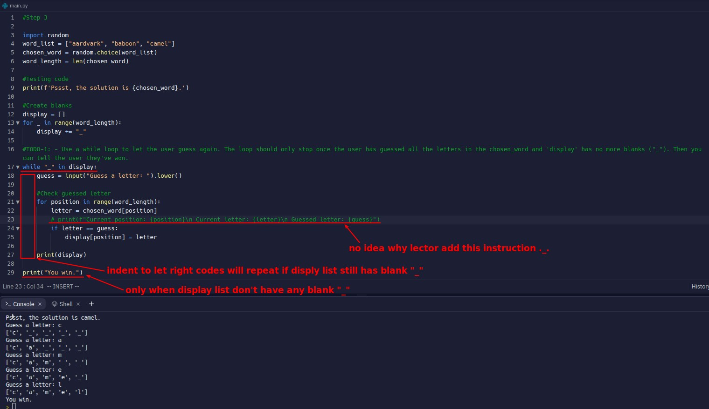
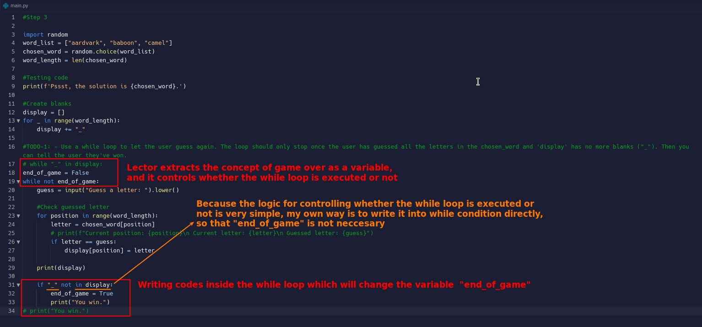

## **Wanted result of this lecture**

## **Hint comment and existed codes**

## **Solutions**

### _Mine_

### _Compare to Lector's_

- My way of writing has fewer codes because it saves a variable, but Lector's method is more readable and is more suitable when the code is more complex.
