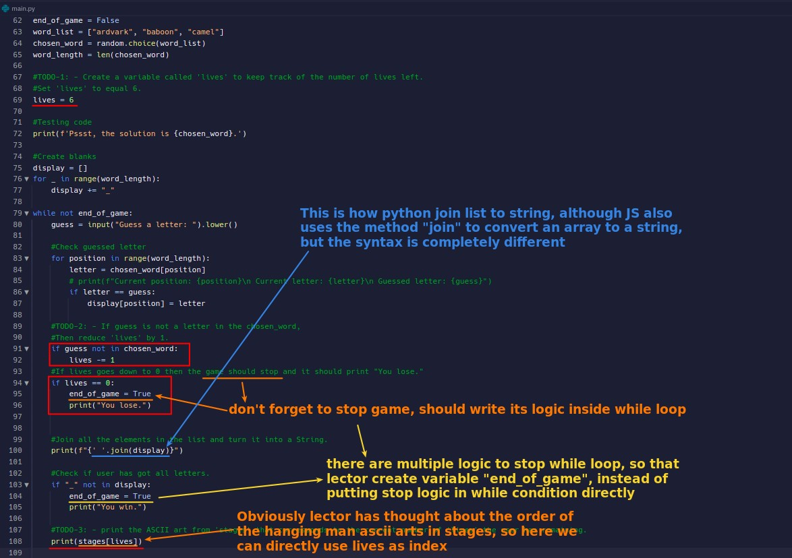

## **Wanted Result**

## **Existed codes and comment hints by lector**

### _ASCII Arts in list_

- In addition to helping us write out the ascii arts for each stage of the hanging man, lector also put them into a list, and the order is meaningful.

### _Comment hints_

## **Solutions**

### _Mine_

### _Compare to lector's_

### _Compare to flowchart_

- After comparing flowchart, we can see more clearly why lector uses nested if statements.

### _Further optimize by flowchart_

> From the flowchart above, we found that there are still some parts that can be optimized.

- According to flowchart we can move some codes to the code block of the user's guessed letter to increase performance.
