## **Wanted Results**

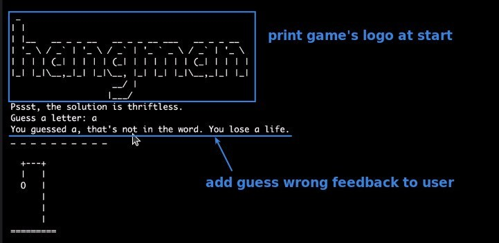

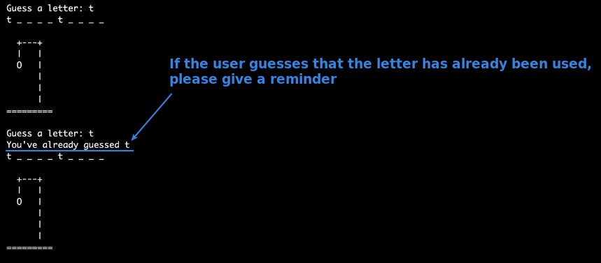

## **Existed codes and To DO Hints**

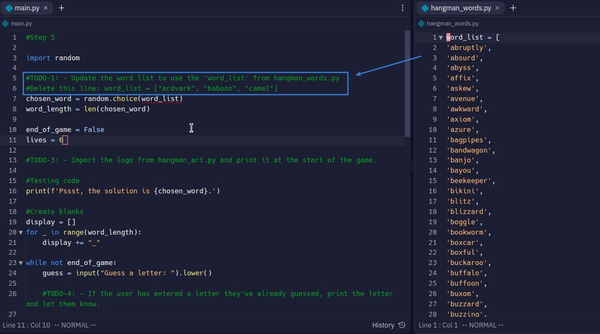

- We also need to think about ourselves when coding, so we will use some simple test data first, and wait until all test results are fine before we use the actual data.

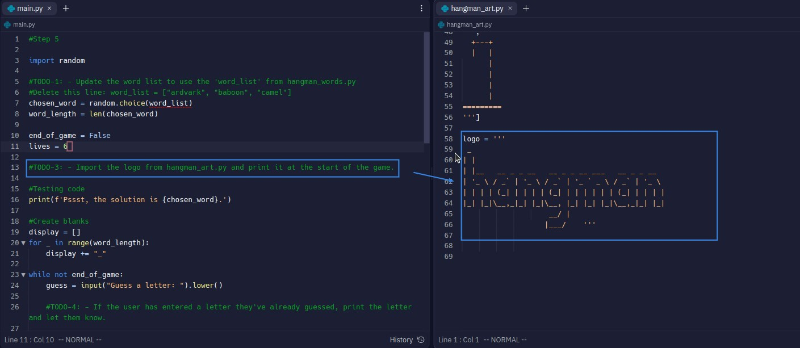

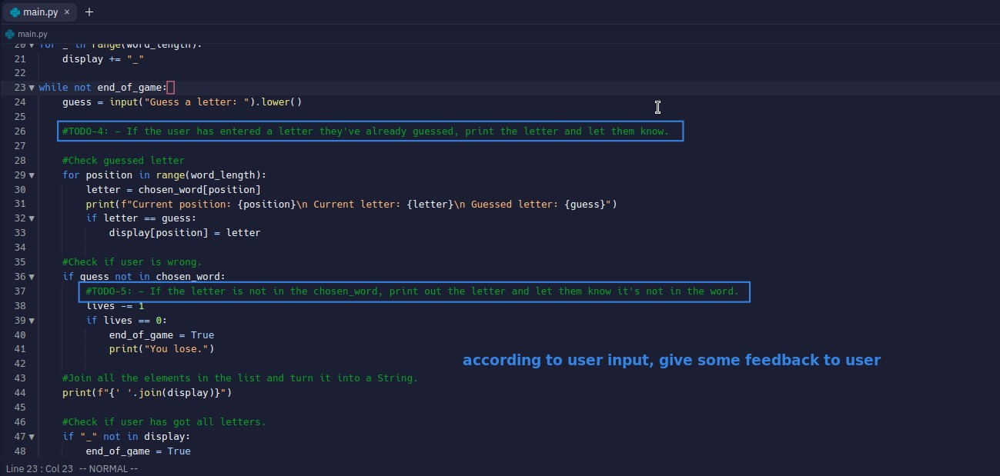

- Make proper feedback to the user according to the user's input, so that the user can have a better experience playing the game.

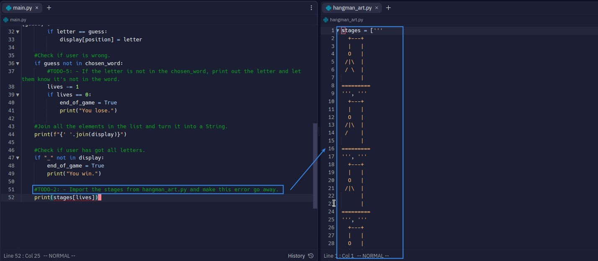

- Transferring ASCII arts to a dedicated module will make our codes more concise.

## **Solutions**

### _Mine_

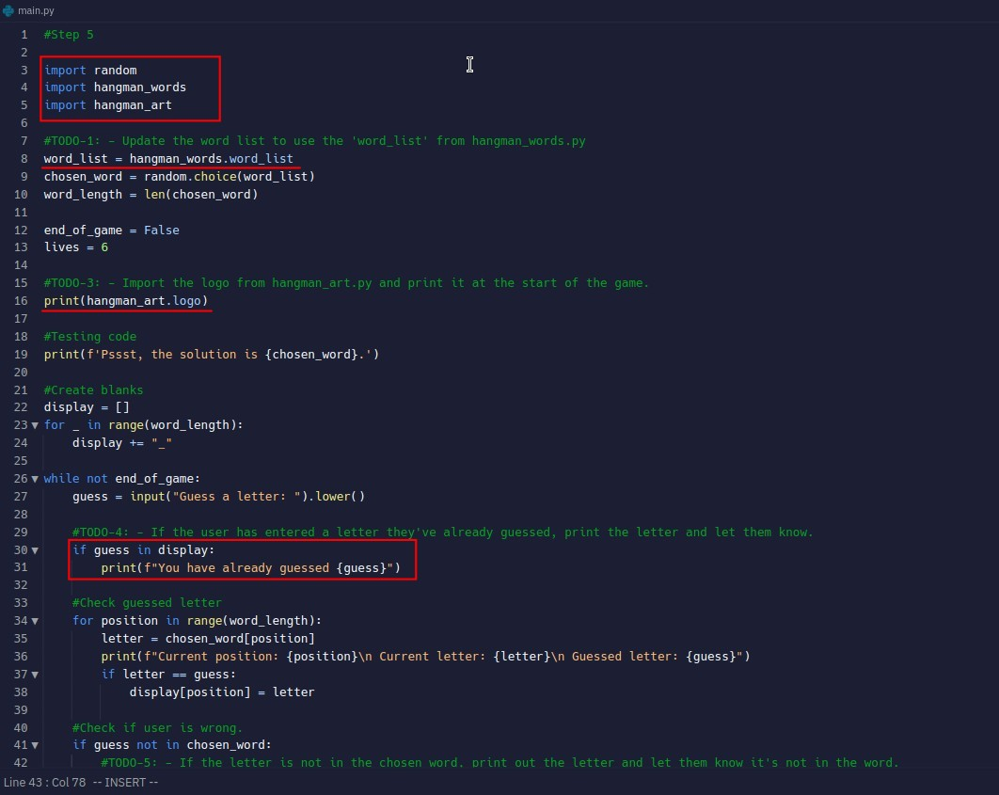

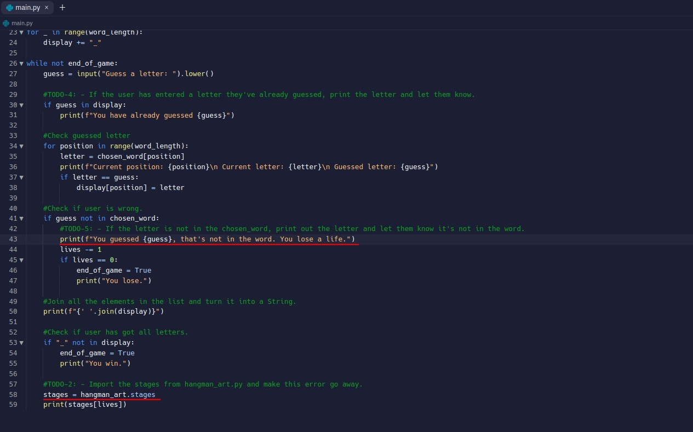

### _Test_

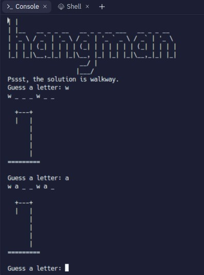

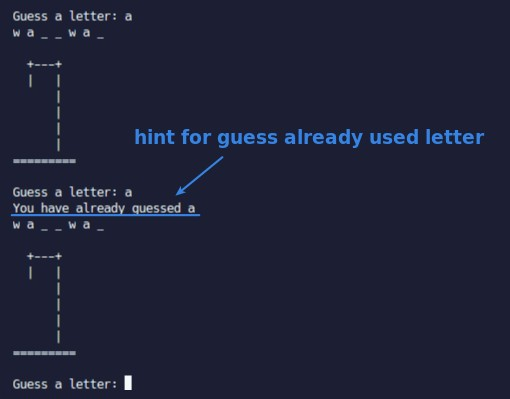

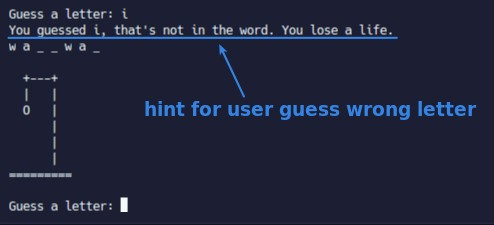

### _Remove codes for testing_

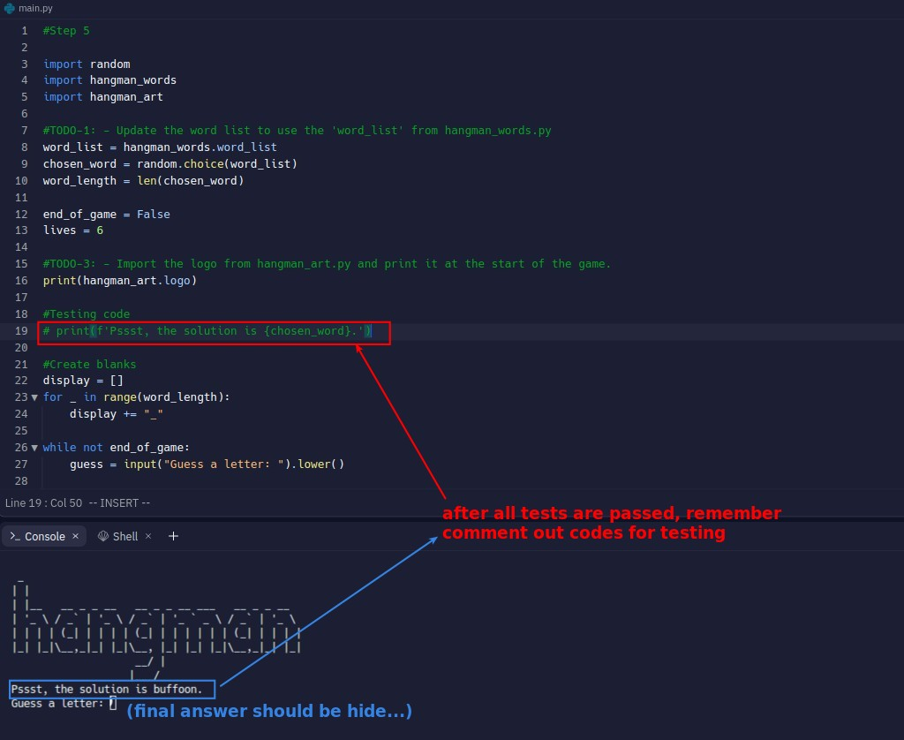

- Users should not know the answer right from the start, this string exists solely for the convenience of our developers, remember to remove it when it goes live.
  - So in addition to simple test data, some print strings for testing or development can also make us more comfortable when developing.

### _Compare to Lector's_

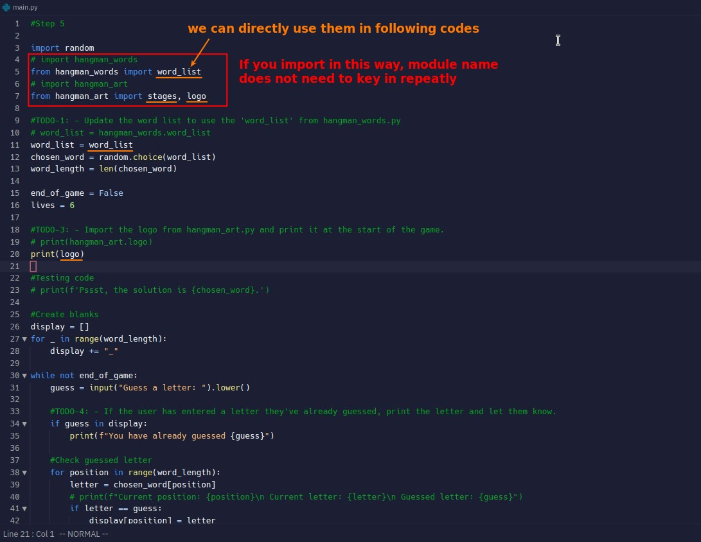
