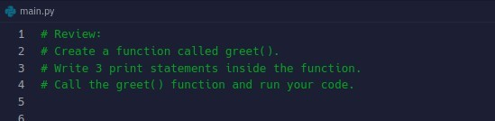
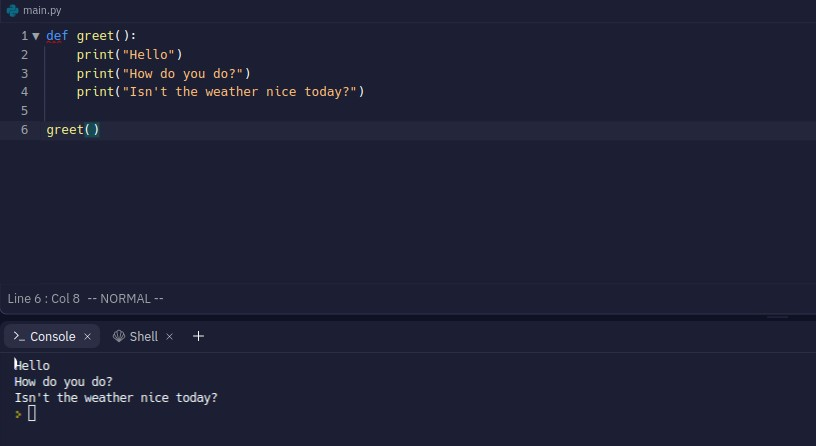
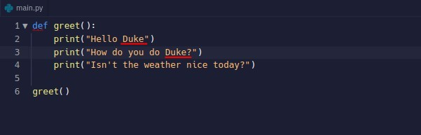
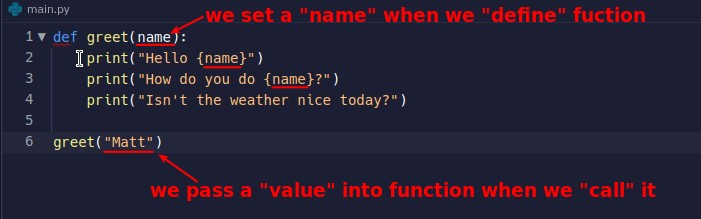
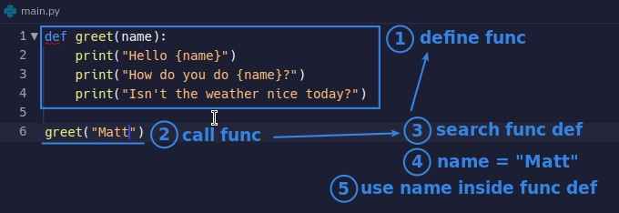
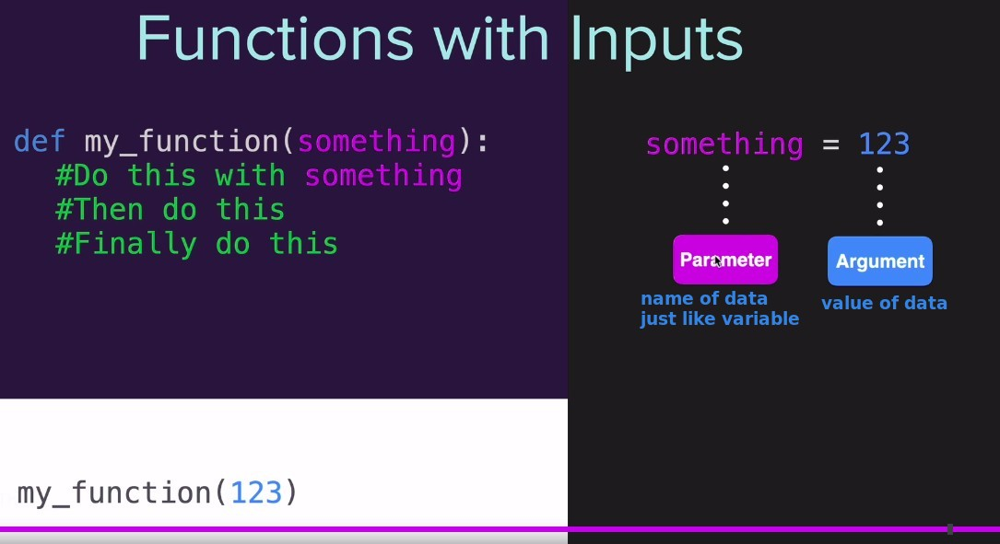

## **Challenge for Reviewing function**

### _Q_

### _A_

## **If I want to greet to multiple specific people**

- Wouldn't it be too much trouble if I had to change the function definition every time? Is there a more convenient way?

## **Use parameter and argument**

> function allows us to call it in a way that allows us to give it some value to vary the result it produces.

