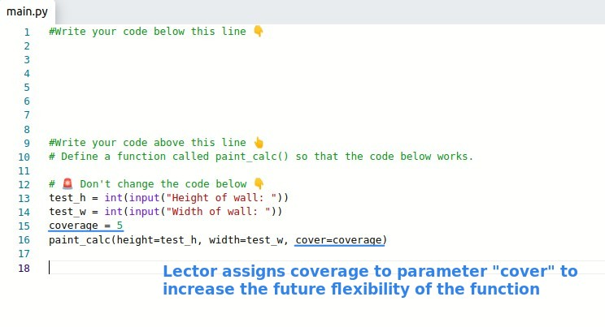

## **Exercise: Paint Area Calc**

## **Existed Codes and Hint comments by Lector**

- Lector has already written the part that calls the function, and she calls it with keyword arguments way to avoid any position mistake.

## **My solution**

- If num_can has decimals, it must be rounded up, because paint can only be sold as a basic unit in a barrel.
