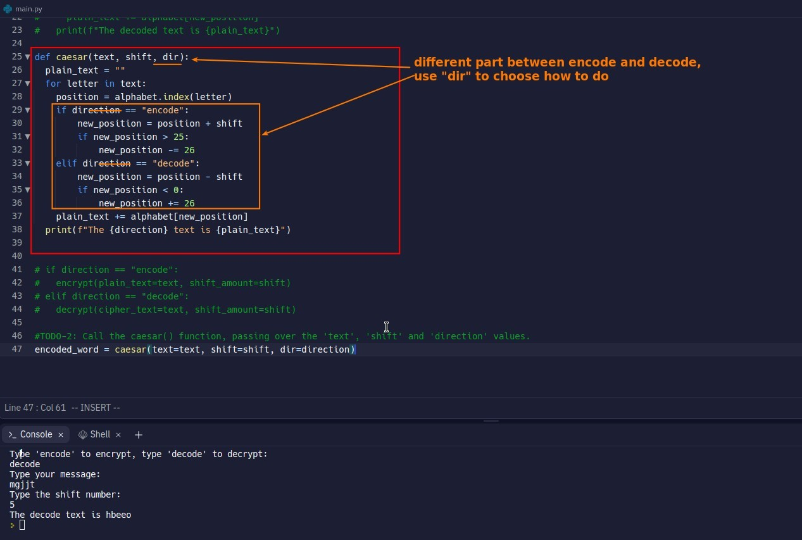

## **Caesar Cipher statge 3: Refactor**

## **My solution**

- If there are too many duplicate parts in different codes blocks, you can consider combining them into one function, and use if-condition to separate the different parts.

## **Further refactor codes blocks of true/false conditions**

> If you feel that there is a lot of duplication between different codes blocks in the if-statement, and most of them are just in different sign directions, you can simplify it by adding a multiplier as follows.

