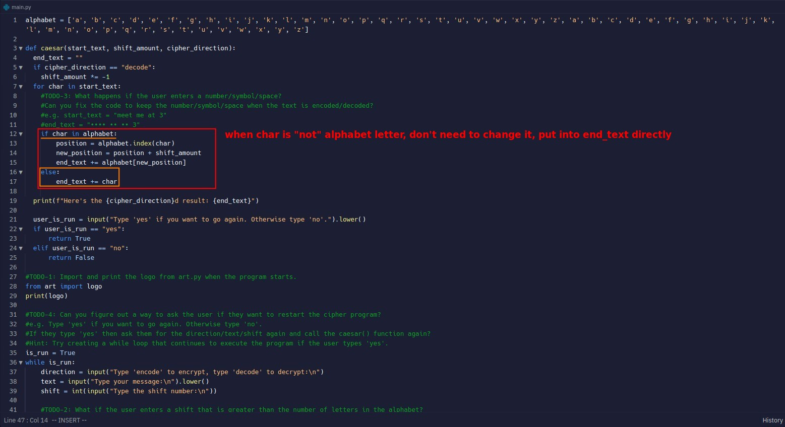

## **My solutions**

### _TODO-1: print logo at very start of app_

### _TODO-2: Dealing with large shift values_

### _TODO-3: Dealing with number/symbol/space in the text_

### _Re-run or exit app according to user's wishes_

## **TEST**

## **Compare to lector's solution**

