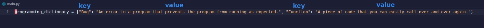
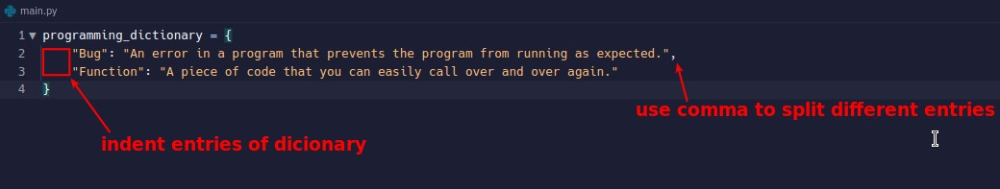
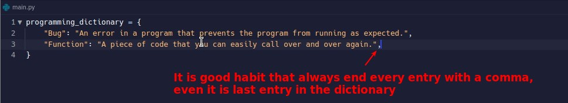
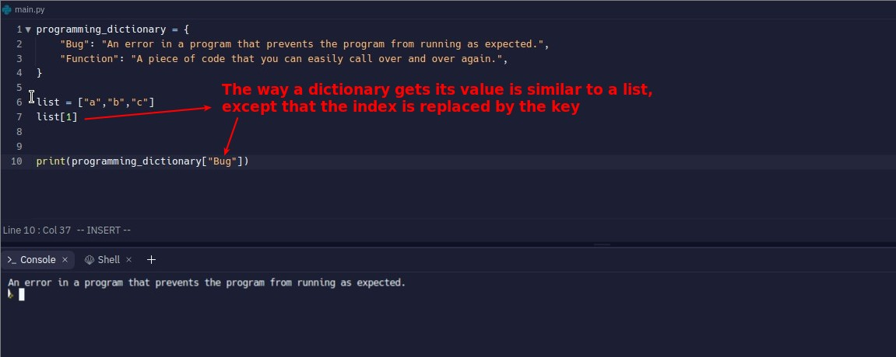
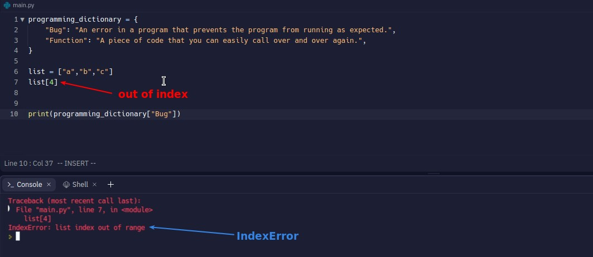
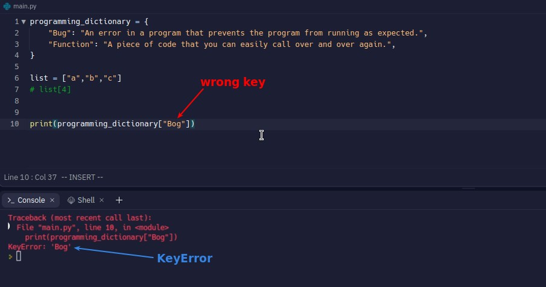
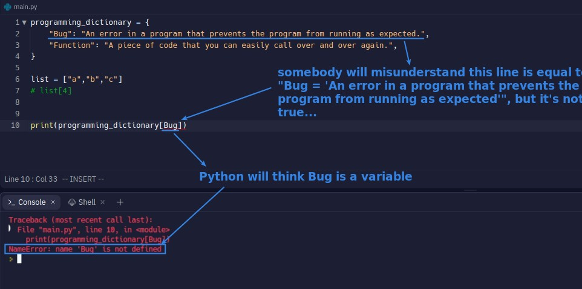
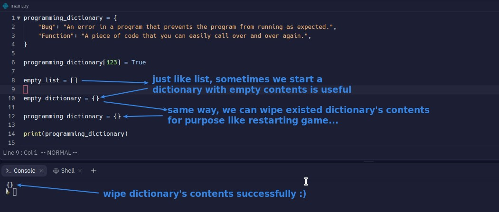
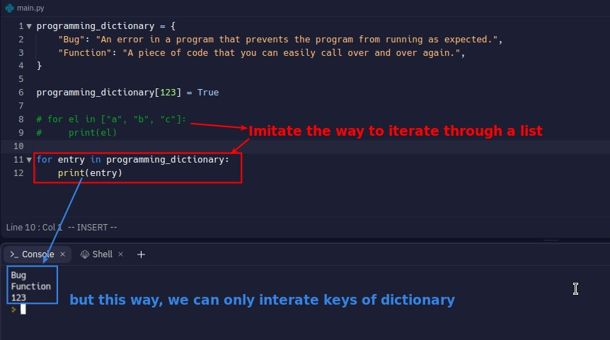
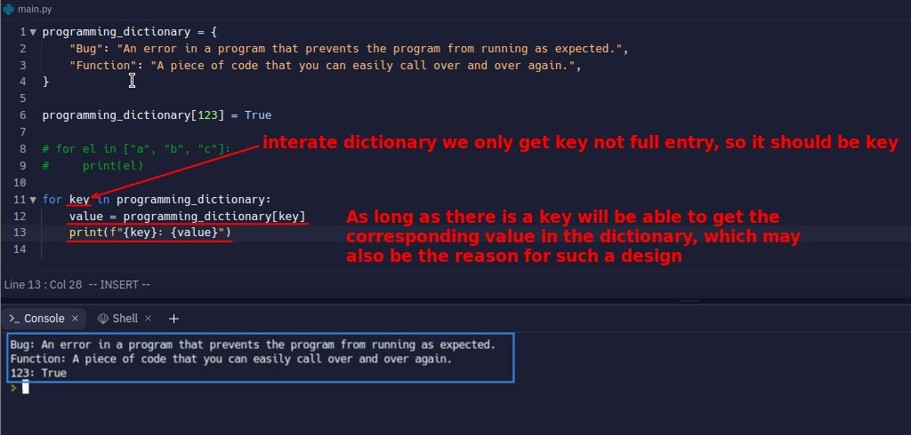

## **Structure of dict**

## **Good habit to deal with dict**

### _Better formatter_

- We usually organize the dict into a more readable format as above, but pay special attention to how to indent it.

### _End every entry with a comma_

- It is recommended to use comma at the end of each entry to make it less prone to make errors.

## **Get value from dictionary**

## **Errors**

## **Add entry into dict & types of key and value**

- The data in a dict, whether it is a key or a value, has no restrictions on its type.
  - This is more similar to a map in JS than an object.

## **Empty dict & Wipe all contents of dict**

## **Iteration**

- So the keys in dict can be iterated, which is similar to the map in JS, where the object is not an iteration.

- This concept is actually as same as map in JS.
