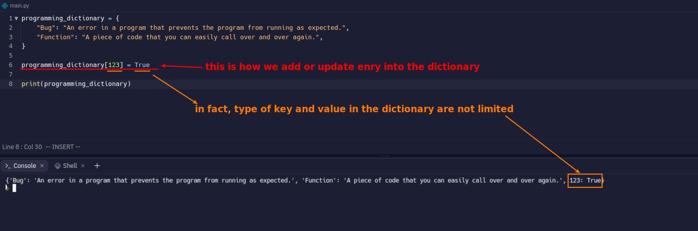
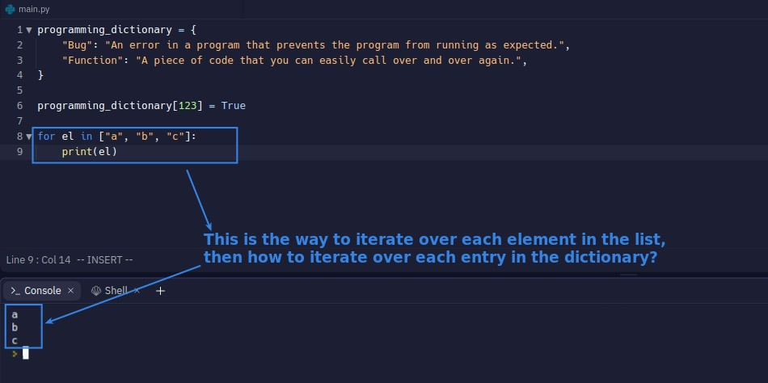

## **Structure of dict**

## **Good habit to deal with dict**

## **Get value from dictionary**

## **Errors**

## **Add entry into dict & types of key and value**

## **Empty dict & Wipe all contents of dict**

## **Iteration**

