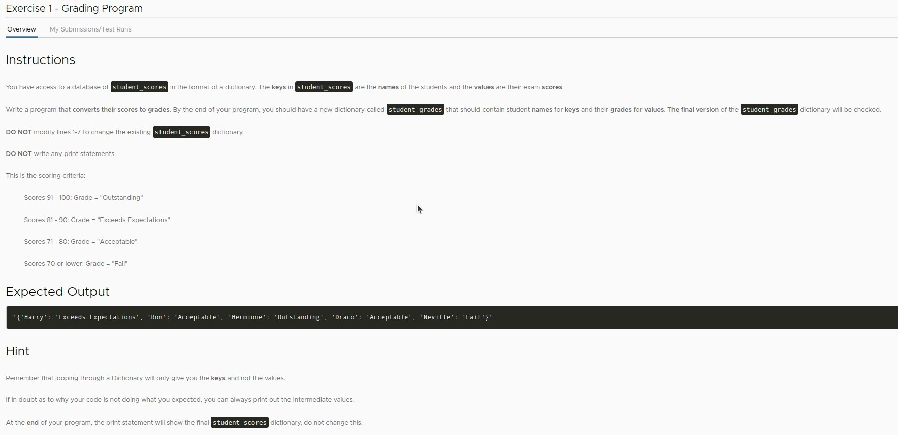

## **Exercise: Grading program**

### _Instruction_

### _Existed codes and comments by lector_

- So the question only asks us to generate a dict with value of grade from a dict with value of score.

## **My solution**

