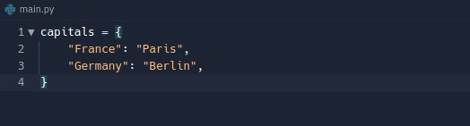

## **Why do I need Nested Dictionary?**

- Above is a simple dictionary, recording the capital of each country is enough.

- If I change the needs, it becomes necessary to record the cities visited by each country.
  - Because cities is a multiple value, so now it becomes a key to multiple values, which is not reasonable in the structure of the dictionary.

## **Nested Dictionary**

### _Nesting List in a Dict_

- We solve the problem by wrapping multiple cities into a list, which fits the dist structure of one key to one value.

### _Nesting Dict in a Dict_

> If the number of times I visited each city should be included, what should I do?

- We can use nesting dict instead of nesting list, because nesting dict can contain more information.
  - Why don't we all use nesting dict?
    - Because a list is ordered compared to a dict, it is better to get values from it and easier to do loop processing.

- The above is the way lector is rewritten in the video, obviously I misunderstood the need she was trying to satisfy, or maybe it was because lector complicated the need a bit for teaching purposes.

### _Nesting Dict in a List_

- Looking closely, we can find that the structure of two nesting dict is the same, is it reasonable for us to use dict to wrap these two similar nesting dict?

- We instead use a list to wrap two nesting dicts. It just make more sense.
- But each nesting dict has its own key to solve, the solution is to write it into the nesting dict as another key-value pair.
- In fact, Nesting Dict in a List is the most common form of data we will see.
