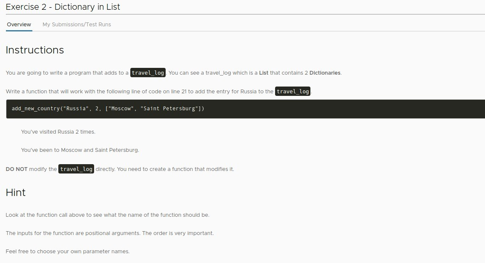
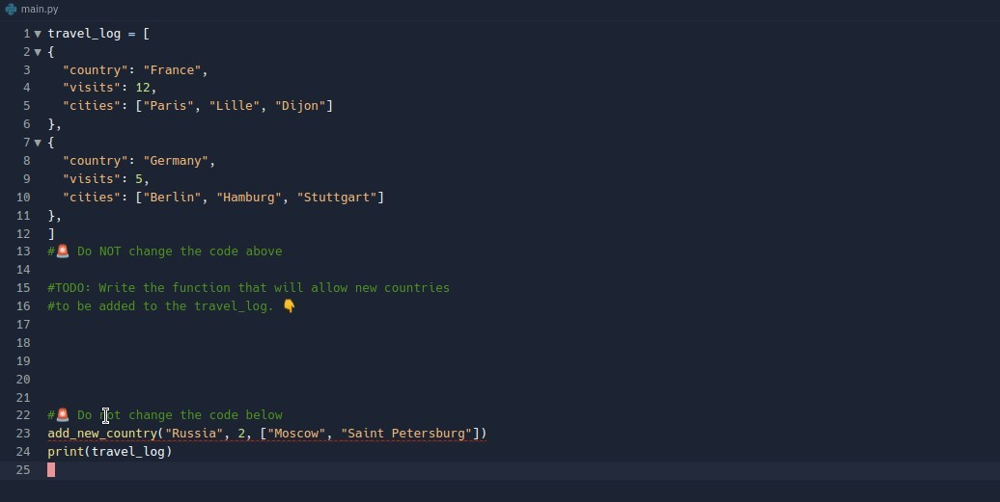
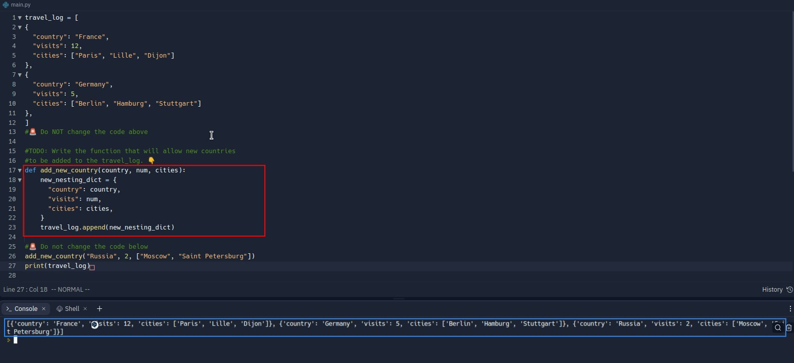
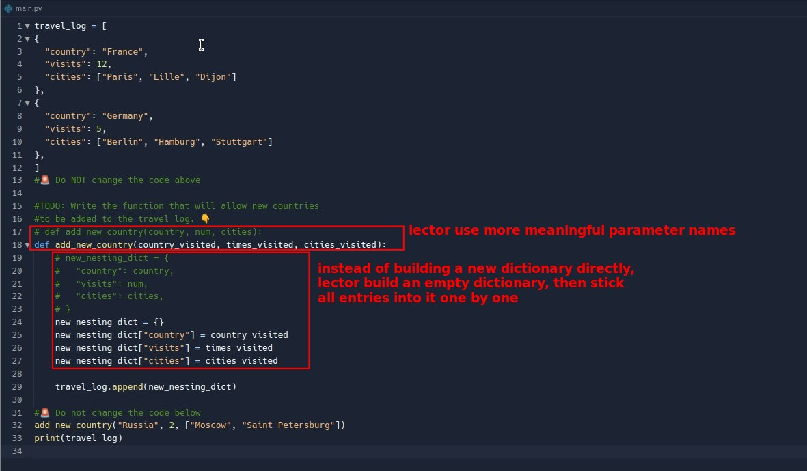

## **Exercise: Adding New Country**

### _Instruction & Hints_

### _Existed codes and comments by Lector_

- Notice how lector calls add_new_country, which contains the parameters we need to write in.

## **Solutions**

### _Mine_

### _Compare to Lector's_

- lector's approach may have more line of code to create empty dictionary, but there is no indentation at all so that the readability is higher.
