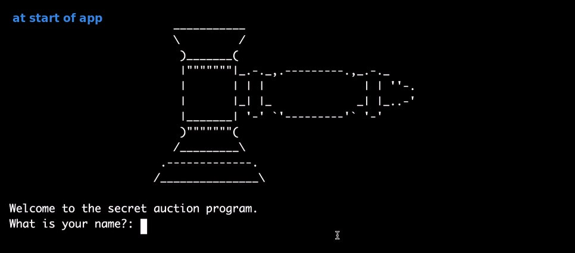
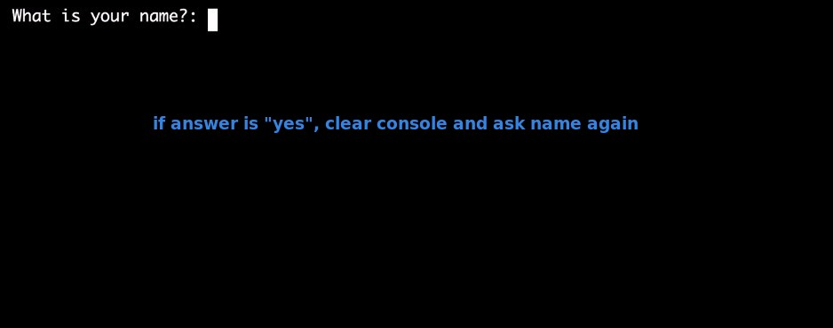
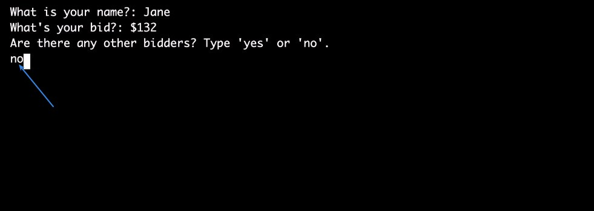
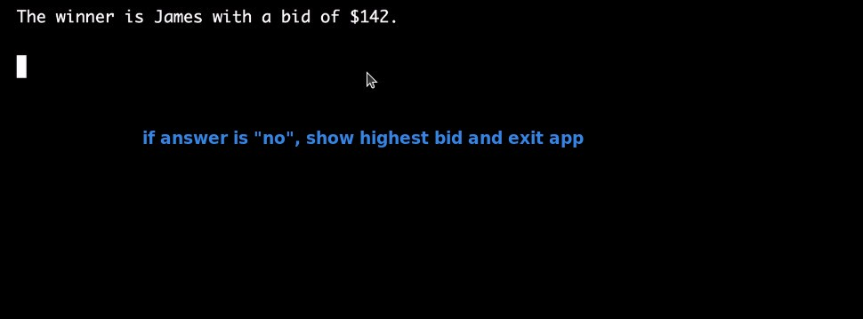
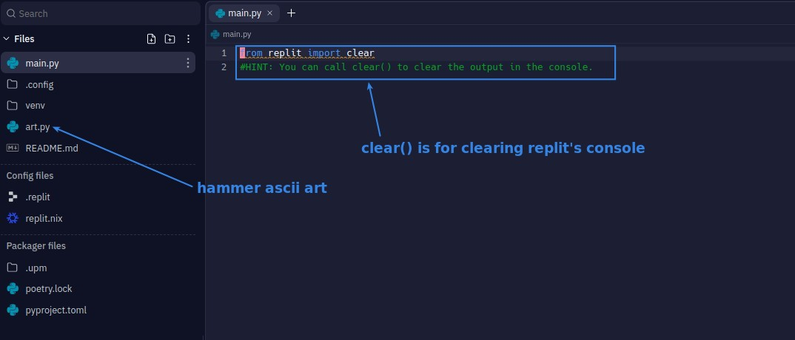
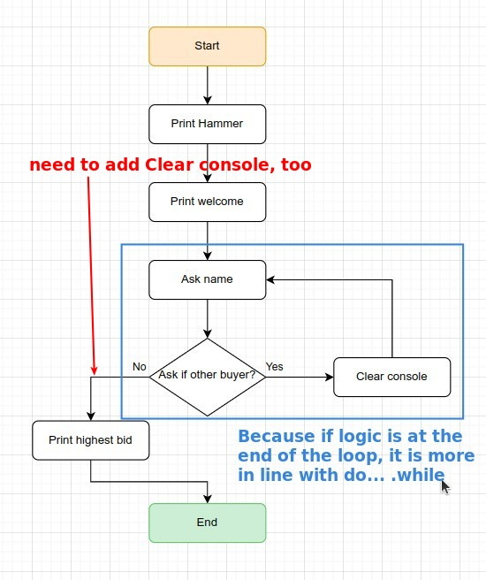
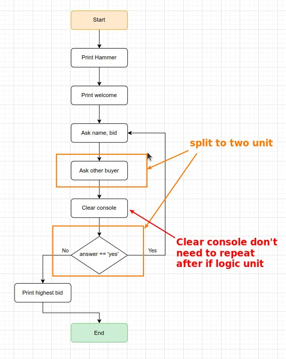
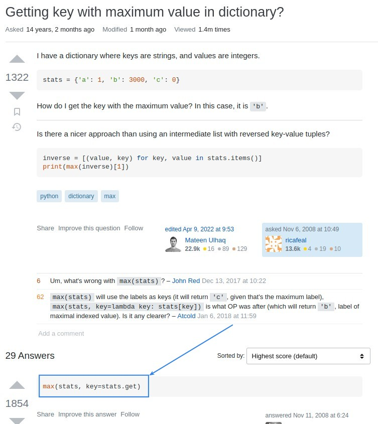
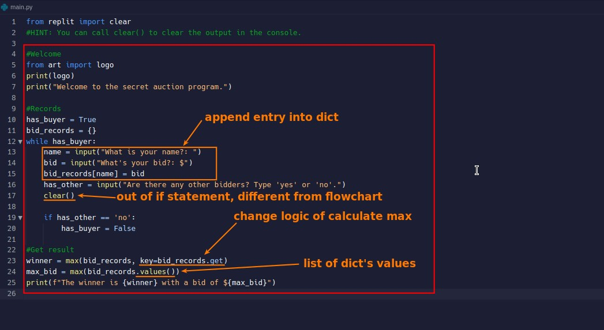

## **Wanted result**

## **My flowchart**

- The hesitation is whether to split the "Ask if there are other buyers" and "Are there other buyers" into two units, if so "Clear console" can be put in front of the if logic unit, which is more in line with the actual program writing content and does not need to repeat it in the flowchart.

- The above is to split the "ask if ..." into "action" and "if" two units, so that "Clear console" can be moved in front of the if logic unit without repeating itself.

## **Google Survey**

### _do...while in Python_

- After surveying, there is no do...while syntax in Python, but it can be simulated simply as above.

### _How to get the key with max value in dictionary_

## **My solution**

